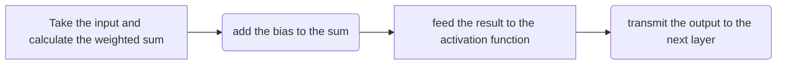

# Basic Intro about Activation Function

- Imagine you are working as a fraud detection analyst for a bank. Your job is to identify fraudulent transactions before they are processed. You have a large dataset of historical transactions, and you want to train a neural network to learn to identify fraudulent transactions.
- Without activation functions, the neural network would simply learn a linear relationship between the input features (such as the amount of money transferred, the time of day, and the location of the transaction) and the output label (fraudulent or not fraudulent). However, most fraudulent transactions are not linearly separable from legitimate transactions. This means that a linear model would not be able to accurately identify fraudulent transactions.
- To address this problem, you can use activation functions to introduce non-linearity into the neural network. This will allow the neural network to learn more complex relationships between the input features and the output label, which will improve its ability to identify fraudulent transactions.
- **For Example**: 
    - You could use the sigmoid activation function to transform the output of each neuron into a value between 0 and 1. This would allow the neural network to learn to classify transactions as either fraudulent (output = 1) or not fraudulent (output = 0).
    - You could also use the ReLU activation function to transform the output of each neuron into a value that is greater than or equal to zero. This would allow the neural network to learn to ignore irrelevant features and focus on the most important features for fraud detection.
> Note: Activation functions in neural networks allow the network to learn non-linear relationships between the input and output data. This is important because many real-world problems involve non-linear relationships. Without activation functions, neural networks would only be able to learn linear relationships. So, By adding an activation function to each neuron, the neural network can learn to make more complex decisions. 

# Why is non-linearity necessary for neural networks to learn complex relationships?

A linear function is a function that can be represented by a straight line. A neural network with only linear layers can only learn linear relationships between its inputs and outputs. However, many real-world problems involve non-linear relationships. For example, the relationship between the price of a house and its square footage is non-linear.

Non-linearity is introduced to neural networks through the use of activation functions. Activation functions are mathematical operations that are applied to the outputs of the neurons in a neural network. They introduce non-linearity into the network, allowing it to learn complex relationships.

Let's say we have a neural network with a single neuron in the hidden layer. The neuron has a weight of 2 and a bias of 1. The input to the neuron is x.

The output of the neuron is calculated as follows:

```python
y = wx + b = 2x + 1
```

We can apply an activation function to the output of this neuron to make it non-linear. For example, we could apply the ReLU activation function, which would give us the following:

```python
y = ReLU(wx + b) = max(0, 2x + 1)
```

The ReLU function will output a value of 0 if the input is negative, and the input value if the input is positive. This means that the output of the ReLU function will be non-linear.

In this example, the activation function has transformed the linear function into a non-linear function. This allows the neural network to learn more complex relationships between its inputs and outputs.

# How do activation functions introduce non-linearity to neural networks?

Activation functions are mathematical operations that are applied to the outputs of the neurons in a neural network. They introduce non-linearity into the network, allowing it to learn complex relationships.

Without activation functions, neural networks would be limited to learning linear relationships. This is because a linear function is a function that can be represented by a straight line. A neural network with only linear layers can only learn linear relationships between its inputs and outputs.

The basic process carried out by a neuron in a neural network is:



# Different Activation Functions

We will be going through the following activation functions:
## Sigmoid Function


- The sigmoid function is a common choice for binary classification because it maps any input to a value between 0 and 1, which can be interpreted as a probability.
- The sigmoid function can be a good choice for some applications, but it is important to be aware of its limitations, such as gradient saturation and slow convergence.
- Pros:
    - Utilized in binary classification.
    - Offers an output that can be interpreted as a probability value since it is non-negative and in the range (0, 1).
- Cons:
    -  sharp damp gradients during backpropagation from deeper hidden layers to inputs, gradient saturation, and slow convergence.
- Usage:
    - Sigmoid functions are commonly applied in binary classification scenarios, where the output is binary, typically 0 or 1. This is because the sigmoid's output range between 0 and 1 allows for straightforward prediction: values greater than 0.5 are predicted as 1, while those less than or equal to 0.5 are predicted as 0.

- Sigmoid is defined as: $S(x)\ = \frac{1}{1 + e^{-x}}$ where, $S(x) = Sigmoid \ Function$ and $e = Euler's\ Number$

# Tanh Activation


- The hyperbolic tangent function, or tanh, is a popular activation function in recurrent neural networks (RNNs) and long short-term memory (LSTM) networks. It maps inputs to values between -1 and 1, which makes it suitable for modeling continuous outputs in this range.
- For Example: The tanh function is a popular activation function for RNNs and LSTMs because it can represent a wide range of values, which is necessary for modeling sequential data.
- Historically, the tanh function became preferred over the sigmoid function as it gave better performance for multi-layer neural networks. 
- But it did not solve the vanishing gradient problem that sigmoids suffered, which was tackled more effectively with the introduction of ReLU activations. [Source](https://paperswithcode.com/method/tanh-activation)
- Pros:
    - The tanh activation function is a zero-centered alternative to the sigmoid activation function, and its output range of [-1, 1] solves one of the issues with the sigmoid function.
- Cons:
    - The tanh activation function also suffers from the vanishing gradient problem, but its derivatives are steeper than the sigmoid function, which makes the gradients stronger for tanh than sigmoid.
    - As it is almost similar to sigmoid, tanh is also computationally expensive.
    - As it is almost similar to sigmoid, tanh is also computationally expensive.
- Usage:
    - Tanh is typically preferred over the sigmoid function for hidden layers because it confines its output within the range of -1 to +1, helping maintain an approximate mean of zero in the hidden layers and facilitating faster convergence during the learning process.
- Hyperbolic Tangent is defined:
$f(x) = \frac{(e^x -\ e^{-x})}{(e^x + e^{-x})}$

## Rectified Linear Units (ReLU)
- The rectified linear unit (ReLU) activation function is commonly used in the hidden layers of feedforward neural networks. It passes the positive input values to the next layer unchanged and sets the negative input values to zero.
- Pros:
    - ReLU is computationally efficient because it only involves simple mathematical operations, unlike the sigmoid and tanh functions which require more complex mathematical operations.
    - Despite its linear appearance, the function adds non-linearity to the network, allowing it to learn complex patterns.
    - ReLU activations address the vanishing gradient problem that sigmoid activations suffer from.
    - The function is unbounded on the positive side, which prevents gradient saturation.
    - Due to sparsity, there is less time and space complexity compared to the sigmoid. This is because, sparse networks are often faster than dense networks because they have fewer connections to compute, resulting in concise models with better predictive power and less overfitting.
- Cons:
    - The issue here is the "dying ReLU problem," where ReLU consistently eliminates negative values, causing the gradients of these units to reach zero. This zero gradient essentially means no weight updates during backpropagation, leading to neurons in this state losing responsiveness to input deviations or errors, ultimately hindering the model's capacity to fit the data effectively.
    - It is non-differentiable at 0.
    - Does not avoid the exploding gradient problem.
Usage:
    - For hidden layers, it's advisable to opt for ReLU activation because it's computationally more efficient than sigmoid and tanh. ReLU is not only faster than both sigmoid and tanh but also ensures that only a few neurons are active simultaneously in hidden layers, making computations efficient.
- Rectified Linear Units (ReLU) is defined as $f(x) = max(0, x)$

## Leaky Rectified Linear Unit (Leaky ReLU)
- Leaky ReLU is a modified version of ReLU that adds a small, non-zero slope to negative inputs. This helps avoid complete inactivity of negative values and proves beneficial in situations where gradients are sparse, like when training generative adversarial networks (GANs).
- Leaky Rectified Linear Unit, known as Leaky ReLU, is an activation function similar to ReLU, but it differs by having a gentle slope for negative values instead of a flat one. The slope value is set prior to training and doesn't change during the training process.
- Pros:
    - Leaky ReLU aims to address the "dying ReLU" issue by avoiding complete suppression of negative inputs, unlike ReLU. Instead of setting negative inputs to zero, Leaky ReLU assigns them very small values proportional to the input. This prevents the gradient from saturating to zero; if the input is negative, the gradient will be a $α$, ensuring that learning occurs for these units as well.
    - Faster to compute, because no exponential operation is included.
- Cons:
    - The main drawback of Leaky ReLU is that the $α$ value remains fixed and is determined as a hyperparameter. Although the commonly used value is 0.01, determining the optimal $α$, whether it should be 0.01, 0.02, or another small constant, is data-dependent. Unfortunately, neural networks do not have the capability to dynamically adapt this value based on the input data. In Short, we can say that, the alpha value is not learned by the neural network.
    - Does not avoid the exploding gradient problem.
    - When differentiated, it becomes a linear function
- Usage:
    - Like ReLU, Leaky ReLU is suitable for use in hidden layers, but it should be considered as an alternative rather than a strict replacement because it may not consistently outperform ReLU.
- The Leaky Rectified Linear Unit is defined as $Leaky\ ReLu(x) = max(αx,x)$ where $x$ is the input and $α$ is a small positive constant.

## ELU (Exponential Linear Unit)
- ELU (Exponential Linear Unit) is an activation function developed to tackle the problems linked to ReLU, and it manages to do this by ensuring that in the negative region, the y-value remains slightly below zero.
- Pros:
    -  Unlike ReLU, It is derivable at 0.
    - ELU has a smooth bend at 0, unlike ReLU, which has a sharp bend. This smoothness helps with optimizing and generalizing in neural networks.
    - Gives negative outputs, which helps adjust the model's parameters in the right way and boosts its learning ability.
    - ELU's negative values work similarly to batch normalization by moving the mean value closer to zero. This speeds up the model's learning process because mean activations near zero reduce bias shifts in the next layer, making the natural gradient align better with the unit's natural gradient.
    - ELU is better than Leaky ReLU and Parametric ReLU when it comes to handling noisy data. While Leaky ReLU and Parametric ReLU can produce large negative outputs for very negative inputs, potentially causing issues with noisy data, ELU's curve in the negative range is more gradual due to the exponential term. This means that negative inputs in ELU don't disrupt the model as much, helping it maintain balance and perform better in the presence of noise.
    - Because of the above characteristic of ELU, the risk of overfitting is also reduced.
- Cons:
    - It is computationally expensive due to the presence of the exponential term.
    - $α$ is a parameter and the alpha value is not learned by the neural network.
    - Does not avoid the exploding gradient problem.
- Usage:
    - It should be used in the hidden layers.
- ELU (Exponential Linear Unit) is defined as: $f(x) = x\ if\ x\ > 0\ else\ α(e^x - 1)$ where $α$ is a hyperparameter whose value lies in the range [0.1,0.3]. When x is positive, ELU is like ReLU, but for negative values of x, y in ELU is just a little below zero.

## Swish Activation Function 
- Up until now, most activation functions we've learned about shared a common trait: they were either always increasing or always decreasing. Which means that they are monotonic in nature. 
- Swish stands out because it's not a monotonic function. If you examine its behavior in the negative range, you'll notice that after reaching 0, it starts decreasing before eventually rising again. This unique feature sets Swish apart from other activation functions.
- Pros:
    - Similar to ReLU, Swish doesn't have an upper limit. This means that even for very large inputs, the outputs don't get stuck at a maximum value as seen in sigmoid and tanh. Consequently, the gradient never becomes zero for any input, which enhances the learning capability.
    - Swish has a lower boundary, meaning that as the input approaches negative infinity, the output approaches a fixed value. This characteristic is crucial because it helps the model overcome many negative values early on, essentially disregarding extremely negative values that can deactivate neurons. This aspect of Swish introduces a form of regularization to the model.
    - Swish is a non-monotonic activation function, which means it doesn't always increase or decrease in the same direction. In the positive region, it behaves similarly to ReLU, but in the negative region, it can decrease even if the input increases. This makes it a more expressive activation function than ReLU, and can help models learn more complex patterns.
    - The Swish activation function is self-gated, which means it uses a sigmoid function to control the amount of information that is passed to the next layer. This is similar to how the gates in LSTM control the flow of information.
        - Self-gating uses a single scalar value as the gate, which is the sigmoid activation of the input itself. This makes it simpler and more efficient than multi-gating, which requires a vector as the gate. In multi-gating, the gate would need to be a vector, which would require more computation and implementation complexity.
    -  The Swish activation function is smooth, which means it does not change direction suddenly like ReLU. This makes the loss function smoother, which helps the optimizer converge faster and generalize better.
- Cons: 
    - It is computationally expensive.
- Usages:
    - The Swish activation function is a newer activation function that has been shown to outperform ReLU on a number of tasks. It is suitable for use in hidden layers
- The Swish Activation Function is defined as: 
    - $f(x) = x.sigmoid(\beta{x})$, where $\beta$ is a learnable parameter. Nearly all implementations do not use the learnable parameter $\beta$, in which case the activation function is $f(x) = x.sigmoid(x)$ which is also known as "Swish-1". 

## Mish Activation Function
- Mish is another non-monotonic activation function, just like Swish.
- Pros:
    - Mish is also unbounded above and bounded below, just like Swish.
    - Mish is a non-monotonic activation function, which means it does not always increase or decrease in the same direction. This is similar to Swish, and it can provide similar benefits, such as improved performance and generalization.
    - Mish is also self-gated, but the gate is the hyperbolic tangent of the softplus of the input $tanh(softplus(x))$ instead of the sigmoid of the input $\sigma(x)$. This difference in the gate is thought to be the reason why Mish performs better than Swish on some tasks.
    - Mish is a continuously differentiable activation function with infinite order, which means it can be differentiated any number of times without introducing any errors. ReLU is only continuously differentiable with first order, which means it can only be differentiated once.
    - It is self regularized. The first derivative of Mish is given by-
    $$f^{'}(x) = sech^2(softplus(x))xsigmoid(x) + \frac{f(x)}{x} = \Delta(x)swish(x) + \frac{f(x)}{x} $$ 
- Cons:
    - It is computationally very expensive.
- Usages:
    - It should be used in the hidden layers.
-  Mish Activation Function is defined as: $f(x) = x.tanh(softplus(x))$, where, $softplus(x) = ln(1+e^x)$ is the softplus activation function. 

##  Softmax Activation Function
- The terms "Softmax-Loss" and "Softmax activation function" can be confusing because they sound similar, but they actually have different meanings. We will explain them in more detail below.
- The softmax function takes the output of a neural network and converts it into a probability distribution over the possible classes. This ensures that the probabilities sum to 1, so they can be interpreted as probabilities.
- Cross-entropy loss tells us how much the model's predictions are off from the actual labels. The lower the cross-entropy loss, the better the model is at predicting the labels.
- Softmax activation and cross-entropy loss are often used together in machine learning models for classification tasks. They are sometimes referred to as "softmax loss" or "softmax cross-entropy loss".
- The name "softmax loss" can be confusing because the softmax function itself is not a loss function. Instead, the softmax function is used to convert the output of a neural network into a probability distribution, and then the cross-entropy loss is applied to the outputs of the softmax function to measure the difference between the predicted distribution and the actual labels.
- The softmax function is a continuous and differentiable function, which means that its output can be represented as a smooth curve and that its derivative can be calculated. This is important for backpropagation, a technique used to train neural networks, because it allows the gradient of the loss function to be calculated with respect to the softmax function's inputs.
- Pros:
    - Utilized in multi-class classification.
- Usage:
    - It should be used in the output layer of a network which is trying to classify object belonging to multiple classes.
- For a given class $s_i$, the Softmax function can be computed as:
$f(x)_i = \frac{e^{s_i}}{\sum_{j}^Ce^{s_j}}$
    - where $s_j$ are the scores inferred by the net for each class in $C$. Note that the Softmax activation for a class $s_i$ depends on all the scores in s.

## Scaled Exponential Linear Unit (SELU)
- Scaled Exponential Linear Units, or SELUs, are activation functions that induce self-normalizing properties.
- Pros
    - SELU activation function does not require external normalization because it can normalize the input to the next layer by itself. This makes the neural network converge more quickly.
    - Vanishing and exploding gradient problems are impossible.
- Cons:
    - SELU activation function works best for sequential network architectures, where the output of each layer is fed directly into the next layer. If the architecture has skipped connections, where the output of one layer is not fed into the next layer, then the self-normalization property of SELU is not guaranteed, and the performance of the network may not be as good.
- Usage:
    - Works best for sequential network architectures
- The SELU activation function is given by: $f(x) = \lambda x\ if x \ge 0$ also this can SELU activation function defined as $f(x) = \lambda \alpha(exp(x) - 1)\ if\ x < 0$ where $\alpha \approx 1.6733$ and $\lambda \approx 1.0507$ 

## Gaussian Error Linear Unit (GELU)
- GELU activation function is $x \Phi(x)$, where $\Phi(x)$ is the standard Gaussian cumulative distribution function. The GELU nonlinearity takes into account the percentile of the input, rather than just its sign, like the ReLU activation function.
- Pros:
    - Appears to be cutting-edge in NLP, particularly in Transformer models.
    - It is a smooth and non-monotonic activation function that has been shown to outperform ReLU in a variety of tasks.
    - Avoids vanishing gradient problem
    - It is more expressive, meaning that it can represent a wider range of functions.
- Cons:
    - Fairly new in practical use, although introduced in 2016.
- Usage:
    - Used in GPT-3, BERT, and most other Transformers.
- The GELU activation function is defined as: $GELU(x) = x * P(X \le x) = x \Phi(x) = x * 0.5 * [1 + erf(x+\sqrt2)]$
    - Where, where $erf$ is the error function and $X$ is a standard normal variable.


