# LLM-PowerHouse: A Curated Guide for Large Language Models with Custom Training and Inferencing
Welcome to LLM-PowerHouse, your ultimate resource for unleashing the full potential of Large Language Models (LLMs) with custom training and inferencing. This GitHub repository is a comprehensive and curated guide designed to empower developers, researchers, and enthusiasts to harness the true capabilities of LLMs and build intelligent applications that push the boundaries of natural language understanding.

# Table of contents 

- [In-Depth Articles](#in-depth-articles)
    - [NLP](#nlp)
    - [Models](#models)
    - [Training](#training)
    - [Enhancing Model Compression: Inference and Training Optimization Strategies](#enhancing-model-compression-inference-and-training-optimization-strategies)
    - [Evaluation Metrics](#evaluation-metrics)
    - [Open LLMs](#open-llms)
    - [Resources for cost analysis and network visualization](#resources-for-cost-analysis-and-network-visualization)
- [Codebase Mastery: Building with Perfection](#codebase-mastery-building-with-perfection)
- [Codebase Mastery: Building with Perfection](#codebase-mastery-building-with-perfection)
- [LLM PlayLab](#llm-playlab)
- [What I am learning](#what-i-am-learning)
- [Contributing](#contributing)
- [License](#license)

# LLM Scientist

```mermaid
graph LR
    Scientist["LLM Scientist 👩‍🔬"] --> Architecture["The LLM architecture 🏗️"]
    Scientist["LLM Scientist 👩‍🔬"] --> Instruction["Building an instruction dataset 📚"]
    Scientist["LLM Scientist 👩‍🔬"] --> Pretraining["Pretraining models 🛠️"]
    Scientist["LLM Scientist 👩‍🔬"] --> FineTuning["Supervised Fine-Tuning 🎯"]
    Scientist["LLM Scientist 👩‍🔬"] --> RLHF["RLHF 🔍"]
    Scientist["LLM Scientist 👩‍🔬"] --> Evaluation["Evaluation 📊"]
    Scientist["LLM Scientist 👩‍🔬"] --> Quantization["Quantization ⚖️"]
    Scientist["LLM Scientist 👩‍🔬"] --> Trends["New Trends 📈"]
    Architecture["The LLM architecture 🏗️"] --> HLV["High Level View 🔍"]
    Architecture["The LLM architecture 🏗️"] --> Tokenization["Tokenization 🔠"]
    Architecture["The LLM architecture 🏗️"] --> Attention["Attention Mechanisms 🧠"]
    Architecture["The LLM architecture 🏗️"] --> Generation["Text Generation ✍️"]
    Instruction["Building an instruction dataset 📚"] --> Alpaca["Alpaca-like dataset 🦙"]
    Instruction["Building an instruction dataset 📚"] --> Advanced["Advanced Techniques 📈"]
    Instruction["Building an instruction dataset 📚"] --> Filtering["Filtering Data 🔍"]
    Instruction["Building an instruction dataset 📚"] --> Prompt["Prompt Templates 📝"]
    Pretraining["Pretraining models 🛠️"] --> Pipeline["Data Pipeline 🚀"]
    Pretraining["Pretraining models 🛠️"] --> CLM["Casual Language Modeling 📝"]
    Pretraining["Pretraining models 🛠️"] --> Scaling["Scaling Laws 📏"]
    Pretraining["Pretraining models 🛠️"] --> HPC["High-Performance Computing 💻"]
    FineTuning["Supervised Fine-Tuning 🎯"] --> Full["Full fine-tuning 🛠️"]
    FineTuning["Supervised Fine-Tuning 🎯"] --> Lora["Lora and QLoRA 🌀"]
    FineTuning["Supervised Fine-Tuning 🎯"] --> Axoloti["Axoloti 🦠"]
    FineTuning["Supervised Fine-Tuning 🎯"] --> DeepSpeed["DeepSpeed ⚡"]
    RLHF["RLHF 🔍"] --> Preference["Preference Datasets 📝"]
    RLHF["RLHF 🔍"] --> Optimization["Proximal Policy Optimization 🎯"]
    RLHF["RLHF 🔍"] --> DPO["Direct Preference Optimization 📈"]
    Evaluation["Evaluation 📊"] --> Traditional["Traditional Metrics 📏"]
    Evaluation["Evaluation 📊"] --> General["General Benchmarks 📈"]
    Evaluation["Evaluation 📊"] --> Task["Task-specific Benchmarks 📋"]
    Evaluation["Evaluation 📊"] --> HF["Human Evaluation 👩‍🔬"]
    Quantization["Quantization ⚖️"] --> Base["Base Techniques 🛠️"]
    Quantization["Quantization ⚖️"] --> GGUF["GGUF and llama.cpp 🐐"]
    Quantization["Quantization ⚖️"] --> GPTQ["GPTQ and EXL2 🤖"]
    Quantization["Quantization ⚖️"] --> AWQ["AWQ 🚀"]
    Trends["New Trends 📈"] --> Positional["Positional Embeddings 🎯"]
    Trends["New Trends 📈"] --> Merging["Model Merging 🔄"]
    Trends["New Trends 📈"] --> MOE["Mixture of Experts 🎭"]
    Trends["New Trends 📈"] --> Multimodal["Multimodal Models 📷"]
```    

# In-Depth Articles 

## NLP

| Article | Resources |
| -------- | :---------: |
| LLMs Overview | [🔗](https://github.com/ghimiresunil/LLM-PowerHouse-A-Curated-Guide-for-Large-Language-Models-with-Custom-Training-and-Inferencing/tree/main/Articles/NLP/LLMs%20Overview)|
| NLP Embeddings | [🔗](https://github.com/ghimiresunil/LLM-PowerHouse-A-Curated-Guide-for-Large-Language-Models-with-Custom-Training-and-Inferencing/tree/main/Articles/NLP/NLP%20Embeddings)|
| Sampling | [🔗](https://github.com/ghimiresunil/LLM-PowerHouse-A-Curated-Guide-for-Large-Language-Models-with-Custom-Training-and-Inferencing/blob/main/Articles/NLP/Sampling)| 
| Tokenization | [🔗](https://github.com/ghimiresunil/LLM-PowerHouse-A-Curated-Guide-for-Large-Language-Models-with-Custom-Training-and-Inferencing/tree/articles/Articles/NLP/Tokenization)|
| Transformer | [🔗](https://github.com/ghimiresunil/LLM-PowerHouse-A-Curated-Guide-for-Large-Language-Models-with-Custom-Training-and-Inferencing/tree/main/Articles/NLP/Transformer/Attention%20Is%20All%20You%20Need)|

## Models 

| Article | Resources |
| -------- | :---------: |
| Generative Pre-trained Transformer (GPT) | [🔗](https://github.com/ghimiresunil/LLM-PowerHouse-A-Curated-Guide-for-Large-Language-Models-with-Custom-Training-and-Inferencing/tree/main/Articles/Models/Generative%20Pre-trained%20Transformer%20(GPT))|

## Training 

| Article | Resources |
| -------- | :---------: |
| Activation Function |  [🔗](https://github.com/ghimiresunil/LLM-PowerHouse-A-Curated-Guide-for-Large-Language-Models-with-Custom-Training-and-Inferencing/tree/articles/Articles/Training/Activation%20Function)|
| Fine Tuning Models | [🔗](https://github.com/ghimiresunil/LLM-PowerHouse-A-Curated-Guide-for-Large-Language-Models-with-Custom-Training-and-Inferencing/tree/main/Articles/Training/Fine%20Tuning%20Models)|
| Enhancing Model Compression: Inference and Training Optimization Strategies | [🔗](https://github.com/ghimiresunil/LLM-PowerHouse-A-Curated-Guide-for-Large-Language-Models-with-Custom-Training-and-Inferencing/tree/main/Articles/Training/Model%20Compression)|
| Model Summary | [🔗](https://github.com/ghimiresunil/LLM-PowerHouse-A-Curated-Guide-for-Large-Language-Models-with-Custom-Training-and-Inferencing/tree/articles/Articles/Training/Model%20Summary)|
| Splitting Datasets | [🔗](https://github.com/ghimiresunil/LLM-PowerHouse-A-Curated-Guide-for-Large-Language-Models-with-Custom-Training-and-Inferencing/tree/articles/Articles/Training/Splitting%20Datasets)|
| Train Loss > Val Loss | [🔗](https://github.com/ghimiresunil/LLM-PowerHouse-A-Curated-Guide-for-Large-Language-Models-with-Custom-Training-and-Inferencing/tree/articles/Articles/Training/Train%20Loss%20%3E%20Val%20Loss)|
| Parameter Efficient Fine-Tuning | [🔗](https://github.com/ghimiresunil/LLM-PowerHouse-A-Curated-Guide-for-Large-Language-Models-with-Custom-Training-and-Inferencing/tree/articles/Articles/Training/Parameter%20Efficient%20Fine-Tuning) |
| Gradient Descent and Backprop | [🔗](https://github.com/ghimiresunil/LLM-PowerHouse-A-Curated-Guide-for-Large-Language-Models-with-Custom-Training-and-Inferencing/tree/articles/Articles/Training/Gradient%20Descent%20and%20Backprop) |
| Overfitting And Underfitting | [🔗](https://github.com/ghimiresunil/LLM-PowerHouse-A-Curated-Guide-for-Large-Language-Models-with-Custom-Training-and-Inferencing/tree/main/Articles/Training/Overfitting%20And%20Underfitting)| 
| Gradient Accumulation and Checkpointing | [🔗](https://github.com/ghimiresunil/LLM-PowerHouse-A-Curated-Guide-for-Large-Language-Models-with-Custom-Training-and-Inferencing/tree/main/Articles/Training/Gradient%20Accumulation%20and%20Checkpointing)| 
| Flash Attention| [🔗](https://github.com/ghimiresunil/LLM-PowerHouse-A-Curated-Guide-for-Large-Language-Models-with-Custom-Training-and-Inferencing/tree/main/Articles/Training/Flash%20Attention)| 

## Enhancing Model Compression: Inference and Training Optimization Strategies

| Article | Resources |
| -------- | :---------: |
| Quantization | [🔗](https://github.com/ghimiresunil/LLM-PowerHouse-A-Curated-Guide-for-Large-Language-Models-with-Custom-Training-and-Inferencing/tree/main/Articles/Model%20Compression/Quantization)|
| Knowledge Distillation | [🔗](https://github.com/ghimiresunil/LLM-PowerHouse-A-Curated-Guide-for-Large-Language-Models-with-Custom-Training-and-Inferencing/tree/main/Articles/Model%20Compression/Knowledge%20Distillation)|
| Pruning | [🔗](https://github.com/ghimiresunil/LLM-PowerHouse-A-Curated-Guide-for-Large-Language-Models-with-Custom-Training-and-Inferencing/tree/main/Articles/Model%20Compression/Pruning)|
| DeepSpeed | [🔗](https://github.com/ghimiresunil/LLM-PowerHouse-A-Curated-Guide-for-Large-Language-Models-with-Custom-Training-and-Inferencing/tree/main/Articles/Model%20Compression/DeepSpeed)|
| Sharding | [🔗](https://github.com/ghimiresunil/LLM-PowerHouse-A-Curated-Guide-for-Large-Language-Models-with-Custom-Training-and-Inferencing/tree/main/Articles/Model%20Compression/Sharding)|
| Mixed Precision Training | [🔗](https://github.com/ghimiresunil/LLM-PowerHouse-A-Curated-Guide-for-Large-Language-Models-with-Custom-Training-and-Inferencing/tree/main/Articles/Model%20Compression/Mixed%20Precision%20Training)|
| Inference Optimization | [🔗](https://github.com/ghimiresunil/LLM-PowerHouse-A-Curated-Guide-for-Large-Language-Models-with-Custom-Training-and-Inferencing/tree/main/Articles/Model%20Compression/Inference%20Optimization)|

## Evaluation Metrics 
| Article | Resources |
| -------- | :---------: |
| Classification | [🔗](https://github.com/ghimiresunil/LLM-PowerHouse-A-Curated-Guide-for-Large-Language-Models-with-Custom-Training-and-Inferencing/tree/articles/Articles/Evaluation%20Metrics/Classification)|
| Regression | [🔗](https://github.com/ghimiresunil/LLM-PowerHouse-A-Curated-Guide-for-Large-Language-Models-with-Custom-Training-and-Inferencing/tree/articles/Articles/Evaluation%20Metrics/Regression)| 
| Generative Text Models | [🔗](https://github.com/ghimiresunil/LLM-PowerHouse-A-Curated-Guide-for-Large-Language-Models-with-Custom-Training-and-Inferencing/tree/articles/Articles/Evaluation%20Metrics/Generative%20Text%20Models)|

## Open LLMs
| Article | Resources |
| -------- | :---------: |
| Open Source LLM Space for Commercial Use | [🔗](https://github.com/ghimiresunil/LLM-PowerHouse-A-Curated-Guide-for-Large-Language-Models-with-Custom-Training-and-Inferencing/tree/main/Articles/Open%20LLMs/Commercial%20Use)|
| Open Source LLM Space for Research Use | [🔗](https://github.com/ghimiresunil/LLM-PowerHouse-A-Curated-Guide-for-Large-Language-Models-with-Custom-Training-and-Inferencing/tree/main/Articles/Open%20LLMs/Research%20Use)|
| LLM Training Frameworks | [🔗](https://github.com/ghimiresunil/LLM-PowerHouse-A-Curated-Guide-for-Large-Language-Models-with-Custom-Training-and-Inferencing/tree/main/Articles/Open%20LLMs/LLM%20Training%20Frameworks)|
| Effective Deployment Strategies for Language Models | [🔗](https://github.com/ghimiresunil/LLM-PowerHouse-A-Curated-Guide-for-Large-Language-Models-with-Custom-Training-and-Inferencing/tree/main/Articles/Open%20LLMs/Deployment)|
| Tutorials about LLM | [🔗](https://github.com/ghimiresunil/LLM-PowerHouse-A-Curated-Guide-for-Large-Language-Models-with-Custom-Training-and-Inferencing/tree/main/Articles/Open%20LLMs/Tutorials)|
| Courses about LLM | [🔗](https://github.com/ghimiresunil/LLM-PowerHouse-A-Curated-Guide-for-Large-Language-Models-with-Custom-Training-and-Inferencing/tree/main/Articles/Open%20LLMs/Courses)|
| Deployment | [🔗](https://github.com/ghimiresunil/LLM-PowerHouse-A-Curated-Guide-for-Large-Language-Models-with-Custom-Training-and-Inferencing/tree/main/Articles/Open%20LLMs/Deployment)|

## Resources for cost analysis and network visualization
| Article | Resources |
| -------- | :---------: |
| Lambda Labs vs AWS Cost Analysis | [🔗](https://github.com/ghimiresunil/LLM-PowerHouse-A-Curated-Guide-for-Large-Language-Models-with-Custom-Training-and-Inferencing/tree/main/Articles/Resources)|
| Neural Network Visualization | [🔗](https://github.com/ghimiresunil/LLM-PowerHouse-A-Curated-Guide-for-Large-Language-Models-with-Custom-Training-and-Inferencing/tree/main/Articles/Resources/Neural%20Network%20Visualization)|

# Codebase Mastery: Building with Perfection 
| Title | Repository | 
| ------- | :--------:|
| Instruction based data prepare using OpenAI | [🔗](https://github.com/ghimiresunil/LLM-PowerHouse-A-Curated-Guide-for-Large-Language-Models-with-Custom-Training-and-Inferencing/tree/main/example_codebase/data_generate_prepare)|
| Optimal Fine-Tuning using the Trainer API: From Training to Model Inference| [🔗](https://github.com/ghimiresunil/LLM-PowerHouse-A-Curated-Guide-for-Large-Language-Models-with-Custom-Training-and-Inferencing/tree/main/example_codebase/train_inference)|
| Efficient Fine-tuning and inference LLMs with PEFT and LoRA| [🔗](https://github.com/ghimiresunil/LLM-PowerHouse-A-Curated-Guide-for-Large-Language-Models-with-Custom-Training-and-Inferencing/tree/main/example_codebase/train_inference_peft_lora)|
| Efficient Fine-tuning and inference LLMs Accelerate| [🔗](https://github.com/ghimiresunil/LLM-PowerHouse-A-Curated-Guide-for-Large-Language-Models-with-Custom-Training-and-Inferencing/tree/main/example_codebase/train_inference_accelerate)|
| Efficient Fine-tuning with T5 | [🔗](https://github.com/ghimiresunil/LLM-PowerHouse-A-Curated-Guide-for-Large-Language-Models-with-Custom-Training-and-Inferencing/tree/main/example_codebase/t5)|
| Train Large Language Models with LoRA and Hugging Face | [🔗](https://github.com/ghimiresunil/LLM-PowerHouse-A-Curated-Guide-for-Large-Language-Models-with-Custom-Training-and-Inferencing/blob/main/example_codebase/Efficiently%20Fine%20Tune%20LLM/Efficiently_train_Large_Language_Models_with_LoRA_and_Hugging_Face.ipynb)|
| Fine-Tune Your Own Llama 2 Model in a Colab Notebook | [🔗](https://github.com/ghimiresunil/LLM-PowerHouse-A-Curated-Guide-for-Large-Language-Models-with-Custom-Training-and-Inferencing/blob/main/example_codebase/Efficiently%20Fine%20Tune%20LLM/Fine_Tune_Your_Own_Llama_2_Model_in_a_Colab_Notebook.ipynb)|
| Guanaco Chatbot Demo with LLaMA-7B Model | [🔗](https://github.com/ghimiresunil/LLM-PowerHouse-A-Curated-Guide-for-Large-Language-Models-with-Custom-Training-and-Inferencing/blob/main/example_codebase/Efficiently%20Fine%20Tune%20LLM/Guanaco%20Chatbot%20Demo%20with%20LLaMA-7B%20Model.ipynb)|
| PEFT Finetune-Bloom-560m-tagger | [🔗](https://github.com/ghimiresunil/LLM-PowerHouse-A-Curated-Guide-for-Large-Language-Models-with-Custom-Training-and-Inferencing/blob/main/example_codebase/Efficiently%20Fine%20Tune%20LLM/PEFT%20Finetune-Bloom-560m-tagger.ipynb)|
| Finetune_Meta_OPT-6-1b_Model_bnb_peft | [🔗](https://github.com/ghimiresunil/LLM-PowerHouse-A-Curated-Guide-for-Large-Language-Models-with-Custom-Training-and-Inferencing/blob/main/example_codebase/Efficiently%20Fine%20Tune%20LLM/Finetune_Meta_OPT-6-1b_Model_bnb_peft.ipynb)|
| Finetune Falcon-7b with BNB Self Supervised Training | [🔗](https://github.com/ghimiresunil/LLM-PowerHouse-A-Curated-Guide-for-Large-Language-Models-with-Custom-Training-and-Inferencing/blob/main/example_codebase/Efficiently%20Fine%20Tune%20LLM/Finetune%20Falcon-7b%20with%20BNB%20Self%20Supervised%20Training.ipynb)|
| FineTune LLaMa2 with QLoRa | [🔗](https://github.com/ghimiresunil/LLM-PowerHouse-A-Curated-Guide-for-Large-Language-Models-with-Custom-Training-and-Inferencing/blob/main/example_codebase/Efficiently%20Fine%20Tune%20LLM/FineTune_LLAMA2_with_QLORA.ipynb)|
| Stable_Vicuna13B_8bit_in_Colab | [🔗](https://github.com/ghimiresunil/LLM-PowerHouse-A-Curated-Guide-for-Large-Language-Models-with-Custom-Training-and-Inferencing/blob/main/example_codebase/Efficiently%20Fine%20Tune%20LLM/Stable_Vicuna13B_8bit_in_Colab.ipynb)|
| GPT-Neo-X-20B-bnb2bit_training | [🔗](https://github.com/ghimiresunil/LLM-PowerHouse-A-Curated-Guide-for-Large-Language-Models-with-Custom-Training-and-Inferencing/blob/main/example_codebase/Efficiently%20Fine%20Tune%20LLM/GPT-neo-x-20B-bnb_4bit_training.ipynb)|
| MPT-Instruct-30B Model Training | [🔗](https://github.com/ghimiresunil/LLM-PowerHouse-A-Curated-Guide-for-Large-Language-Models-with-Custom-Training-and-Inferencing/blob/main/example_codebase/Efficiently%20Fine%20Tune%20LLM/MPT_Instruct_30B.ipynb)|
| RLHF_Training_for_CustomDataset_for_AnyModel | [🔗](https://github.com/ghimiresunil/LLM-PowerHouse-A-Curated-Guide-for-Large-Language-Models-with-Custom-Training-and-Inferencing/blob/main/example_codebase/Efficiently%20Fine%20Tune%20LLM/RLHF_Training_for_CustomDataset_for_AnyModel.ipynb)|
| Fine_tuning_Microsoft_Phi_1_5b_on_custom_dataset(dialogstudio) | [🔗](https://github.com/ghimiresunil/LLM-PowerHouse-A-Curated-Guide-for-Large-Language-Models-with-Custom-Training-and-Inferencing/blob/main/example_codebase/Efficiently%20Fine%20Tune%20LLM/Fine_tuning_Microsoft_Phi_1_5b_on_custom_dataset(dialogstudio).ipynb)|
| Finetuning OpenAI GPT3.5 Turbo | [🔗](https://github.com/ghimiresunil/LLM-PowerHouse-A-Curated-Guide-for-Large-Language-Models-with-Custom-Training-and-Inferencing/blob/main/example_codebase/Efficiently%20Fine%20Tune%20LLM/Fine_tuning_OpenAI_GPT_3_5_turbo.ipynb)|
| Finetuning Mistral-7b FineTuning Model using Autotrain-advanced| [🔗](https://github.com/ghimiresunil/LLM-PowerHouse-A-Curated-Guide-for-Large-Language-Models-with-Custom-Training-and-Inferencing/blob/main/example_codebase/Efficiently%20Fine%20Tune%20LLM/Finetuning_Mistral_7b_Using_AutoTrain.ipynb)|
| RAG LangChain Tutorial | [🔗](https://github.com/ghimiresunil/LLM-PowerHouse-A-Curated-Guide-for-Large-Language-Models-with-Custom-Training-and-Inferencing/blob/main/example_codebase/Efficiently%20Fine%20Tune%20LLM/RAG_LangChain.ipynb)|
| Mistral DPO Trainer | [🔗](https://github.com/ghimiresunil/LLM-PowerHouse-A-Curated-Guide-for-Large-Language-Models-with-Custom-Training-and-Inferencing/tree/main/example_codebase/mistral_trainer_dpo)|
| LLM Sharding | [🔗](https://github.com/ghimiresunil/LLM-PowerHouse-A-Curated-Guide-for-Large-Language-Models-with-Custom-Training-and-Inferencing/blob/main/example_codebase/Efficiently%20Fine%20Tune%20LLM/LLM_Sharding.ipynb)|
| Integrating Unstructured and Graph Knowledge with Neo4j and LangChain for Enhanced Question | [🔗](https://github.com/ghimiresunil/LLM-PowerHouse-A-Curated-Guide-for-Large-Language-Models-with-Custom-Training-and-Inferencing/blob/main/example_codebase/Efficiently%20Fine%20Tune%20LLM/Neo4j_and_LangChain_for_Enhanced_Question_Answering.ipynb)|
| vLLM Benchmarking | [🔗](https://github.com/ghimiresunil/LLM-PowerHouse-A-Curated-Guide-for-Large-Language-Models-with-Custom-Training-and-Inferencing/blob/main/example_codebase/Efficiently%20Fine%20Tune%20LLM/vllm_benchmark.py)|
| Milvus Vector Database | [🔗](https://github.com/ghimiresunil/LLM-PowerHouse-A-Curated-Guide-for-Large-Language-Models-with-Custom-Training-and-Inferencing/tree/main/example_codebase/vector_database)|
| Decoding Strategies | [🔗](https://github.com/ghimiresunil/LLM-PowerHouse-A-Curated-Guide-for-Large-Language-Models-with-Custom-Training-and-Inferencing/tree/main/example_codebase/decoding_strategies)|
| Peft QLora SageMaker Training | [🔗](https://github.com/ghimiresunil/LLM-PowerHouse-A-Curated-Guide-for-Large-Language-Models-with-Custom-Training-and-Inferencing/tree/main/example_codebase/peft_qlora_sm_training)|
| Optimize Single Model SageMaker Endpoint | [🔗](https://github.com/ghimiresunil/LLM-PowerHouse-A-Curated-Guide-for-Large-Language-Models-with-Custom-Training-and-Inferencing/tree/main/example_codebase/optimize_single_model_sm_endpoint)|
| Multi Adapter Inference | [🔗](https://github.com/ghimiresunil/LLM-PowerHouse-A-Curated-Guide-for-Large-Language-Models-with-Custom-Training-and-Inferencing/tree/main/example_codebase/multi_adapter_inference)|
| Inf2 LLM SM Deployment | [🔗](https://github.com/ghimiresunil/LLM-PowerHouse-A-Curated-Guide-for-Large-Language-Models-with-Custom-Training-and-Inferencing/tree/main/example_codebase/Inf2%20LLM%20SM%20Deployment)|

# LLM PlayLab
| LLM Projects  |Respository|
| ------------ | :------------: |
|CSVQConnect   | [🔗](https://github.com/Sakil786/CSVQConnect) |
| AI_VIRTUAL_ASSISTANT  | [🔗](https://github.com/Sakil786/AI_VIRTUAL_ASSISTANT)|
|  DocuBotMultiPDFConversationalAssistant | [🔗](https://github.com/Sakil786/DocuBotMultiPDFConversationalAssistant)  |
|  autogpt |  [🔗](https://github.com/Sakil786/autogpt)|
|  meta_llama_2finetuned_text_generation_summarization | [🔗](https://github.com/Sakil786/-meta_llama_2finetuned_text_generation_summarization)  |
| text_generation_using_Llama|[🔗](https://github.com/Sakil786/text_generation_using_Llama-2/tree/main) |
| llm_using_petals|[🔗](https://github.com/Sakil786/llm_using_petals) |
| llm_using_petals|[🔗](https://github.com/Sakil786/llm_using_petals) |
| Salesforce-xgen|[🔗](https://github.com/Sakil786/Salesforce-xgen)|
| text_summarization_using_open_llama_7b|[🔗](https://github.com/Sakil786/text_summarization_using_open_llama_7b)|
| Text_summarization_using_GPT-J|[🔗](https://github.com/Sakil786/Text_summarization_using_GPT-J)|
| codllama  | [🔗](https://github.com/Sakil786/codllama) |
| Image_to_text_using_LLaVA  | [🔗](https://github.com/Sakil786/Image_to_text_using_LLaVA/tree/main) |
| Tabular_data_using_llamaindex  | [🔗](https://github.com/Sakil786/Tabular_data_using_llamaindex) |
| nextword_sentence_prediction  | [🔗](https://github.com/Sakil786/nextword_sentence_prediction) |
| Text-Generation-using-DeciLM-7B-instruct  | [🔗](https://github.com/Sakil786/Text-Generation-using-DeciLM-7B-instruct) |
| Gemini-blog-creation  | [🔗](https://github.com/Sakil786/Gemini-blog-creation/tree/main) |
| Prepare_holiday_cards_with_Gemini_and_Sheets  | [🔗](https://github.com/Sakil786/Prepare_holiday_cards_with_Gemini_and_Sheets/tree/main) |
| Code-Generattion_using_phi2_llm  | [🔗](https://github.com/Sakil786/Code-Generattion_using_phi2_llm) |
| RAG-USING-GEMINI  | [🔗](https://github.com/Sakil786/RAG-USING-GEMINI) |
| Resturant-Recommendation-Multi-Modal-RAG-using-Gemini  | [🔗](https://github.com/Sakil786/Resturant-Recommendation-Multi-Modal-RAG-using-Gemini) |
| slim-sentiment-tool  | [🔗](https://github.com/Sakil786/slim-sentiment-tool) |
| Synthetic-Data-Generation-Using-LLM  | [🔗](https://github.com/Sakil786/Corporate-Presentations-Synthetic-Data-Generation-Using-LLM) |
| Architecture-for-building-a-Chat-Assistant | [🔗](https://github.com/Sakil786/Design-an-Architecture-for-building-a-Chat-Assistant-for-an-ecommerce-platform) |
| LLM-CHAT-ASSISTANT-WITH-DYNAMIC-CONTEXT-BASED-ON-QUERY | [🔗](https://github.com/Sakil786/LLM-CHAT-ASSISTANT-WITH-DYNAMIC-CONTEXT-BASED-ON-QUERY) |
| Text Classifier using LLM | [🔗](https://github.com/Sakil786/AI-Powered-Text-Classifier-Harnessing-Large-Language-Models-for-Precise-Data-Categorization) |
| Multiclass sentiment Analysis | [🔗](https://github.com/Sakil786/multi-class-sentiment-analysis-model-using-LLM) |
| Text-Generation-Using-GROQ | [🔗](https://github.com/Sakil786/Text-Generation-Using-GROQ) |
| DataAgents | [🔗](https://github.com/Sakil786/DataAgents) |
| PandasQuery_tabular_data | [🔗](https://github.com/Sakil786/PandasQuery_tabular_data) |
| Exploratory_Data_Analysis_using_LLM | [🔗](https://github.com/Sakil786/Exploratory_Data_Analysis_using_LLM/tree/main) |

# What I am learning

After immersing myself in the recent GenAI text-based language model hype for nearly a month, I have made several observations about its performance on my specific tasks.

Please note that these observations are subjective and specific to my own experiences, and your conclusions may differ.

- We need a minimum of 7B parameter models (<7B) for optimal natural language understanding performance. Models with fewer parameters result in a significant decrease in performance. However, using models with more than 7 billion parameters requires a GPU with greater than 24GB VRAM (>24GB).
- Benchmarks can be tricky as different LLMs perform better or worse depending on the task. It is crucial to find the model that works best for your specific use case. In my experience, MPT-7B is still the superior choice compared to Falcon-7B.
- Prompts change with each model iteration. Therefore, multiple reworks are necessary to adapt to these changes. While there are potential solutions, their effectiveness is still being evaluated.
- For fine-tuning, you need at least one GPU with greater than 24GB VRAM (>24GB). A GPU with 32GB or 40GB VRAM is recommended.
- Fine-tuning only the last few layers to speed up LLM training/finetuning may not yield satisfactory results. I have tried this approach, but it didn't work well.
- Loading 8-bit or 4-bit models can save VRAM. For a 7B model, instead of requiring 16GB, it takes approximately 10GB or less than 6GB, respectively. However, this reduction in VRAM usage comes at the cost of significantly decreased inference speed. It may also result in lower performance in text understanding tasks.
- Those who are exploring LLM applications for their companies should be aware of licensing considerations. Training a model with another model as a reference and requiring original weights is not advisable for commercial settings.
- There are three major types of LLMs: basic (like GPT-2/3), chat-enabled, and instruction-enabled. Most of the time, basic models are not usable as they are and require fine-tuning. Chat versions tend to be the best, but they are often not open-source.
- Not every problem needs to be solved with LLMs. Avoid forcing a solution around LLMs. Similar to the situation with deep reinforcement learning in the past, it is important to find the most appropriate approach.
- I have tried but didn't use langchains and vector-dbs. I never needed them. Simple Python, embeddings, and efficient dot product operations worked well for me.
- LLMs do not need to have complete world knowledge. Humans also don't possess comprehensive knowledge but can adapt. LLMs only need to know how to utilize the available knowledge. It might be possible to create smaller models by separating the knowledge component.
- The next wave of innovation might involve simulating "thoughts" before answering, rather than simply predicting one word after another. This approach could lead to significant advancements.
- The overparameterization of LLMs presents a significant challenge: they tend to memorize extensive amounts of training data. This becomes particularly problematic in RAG scenarios when the context conflicts with this "implicit" knowledge. However, the situation escalates further when the context itself contains contradictory information. A recent survey paper comprehensively analyzes these "knowledge conflicts" in LLMs, categorizing them into three distinct types:
    - Context-Memory Conflicts: Arise when external context contradicts the LLM's internal knowledge.
        - Solution
            - Fine-tune on counterfactual contexts to prioritize external information.
            - Utilize specialized prompts to reinforce adherence to context
            - Apply decoding techniques to amplify context probabilities.
            - Pre-train on diverse contexts across documents.

    - Inter-Context Conflicts: Contradictions between multiple external sources.
        - Solution:
            - Employ specialized models for contradiction detection.
            - Utilize fact-checking frameworks integrated with external tools.
            - Fine-tune discriminators to identify reliable sources.
            - Aggregate high-confidence answers from augmented queries.
    - Intra-Memory Conflicts: The LLM gives inconsistent outputs for similar inputs due to conflicting internal knowledge.
        - Solution:
            - Fine-tune with consistency loss functions.
            - Implement plug-in methods, retraining on word definitions.
            - Ensemble one model's outputs with another's coherence scoring.
            - Apply contrastive decoding, focusing on truthful layers/heads.

# Contributing
Contributions are welcome! If you'd like to contribute to this project, feel free to open an issue or submit a pull request.

# License
This project is licensed under the [MIT License](https://github.com/ghimiresunil/LLM-PowerHouse-A-Curated-Guide-for-Large-Language-Models-with-Custom-Training-and-Inferencing/blob/main/LICENSE).

Created with ❤️ by [Sunil Ghimire](https://sunilghimire.com.np/)
