  <h1>🗣️ LLM PowerHouse</h1>
  

    

  
  
  
  
  

   
<em>Unleash LLMs' potential through curated tutorials, best practices, and ready-to-use code for custom training and inferencing.</em>

# Overview
Welcome to LLM-PowerHouse, your ultimate resource for unleashing the full potential of Large Language Models (LLMs) with custom training and inferencing. This GitHub repository is a comprehensive and curated guide designed to empower developers, researchers, and enthusiasts to harness the true capabilities of LLMs and build intelligent applications that push the boundaries of natural language understanding.

# Table of contents 
- [Foundations of LLMs](#foundations-of-llms)
- [Unlock the Art of LLM Science](#unlock-the-art-of-llm-science)
- [In-Depth Articles](#in-depth-articles)
    - [NLP](#nlp)
    - [Models](#models)
    - [Training](#training)
    - [Enhancing Model Compression: Inference and Training Optimization Strategies](#enhancing-model-compression-inference-and-training-optimization-strategies)
    - [Evaluation Metrics](#evaluation-metrics)
    - [Open LLMs](#open-llms)
    - [Resources for cost analysis and network visualization](#resources-for-cost-analysis-and-network-visualization)
- [Codebase Mastery: Building with Perfection](#codebase-mastery-building-with-perfection)
- [LLM PlayLab](#llm-playlab)
- [LLM Datasets](#llm-datasets)
- [What I am learning](#what-i-am-learning)
- [Contributing](#contributing)
- [License](#license)
- [About The Author](#about-the-author)

## Foundations of LLMs

This section offers fundamental insights into mathematics, Python, and neural networks. It may not be the ideal starting point, but you can consult it whenever necessary.

```mermaid
graph LR
    Foundations["📚 Foundations of Large Language Models (LLMs)"] --> ML["1️⃣ Mathematics for Machine Learning"]
    Foundations["📚 Foundations of Large Language Models (LLMs)"] --> Python["2️⃣ Python for Machine Learning"]
    Foundations["📚 Foundations of Large Language Models (LLMs)"] --> NN["3️⃣ Neural Networks"]
    Foundations["📚 Foundations of Large Language Models (LLMs)"] --> NLP["4️⃣ Natural Language Processing (NLP)"]
    
    ML["1️⃣ Mathematics for Machine Learning"] --> LA["📐 Linear Algebra"]
    ML["1️⃣ Mathematics for Machine Learning"] --> Calculus["📏 Calculus"]
    ML["1️⃣ Mathematics for Machine Learning"] --> Probability["📊 Probability & Statistics"]
    
    Python["2️⃣ Python for Machine Learning"] --> PB["🐍 Python Basics"]
    Python["2️⃣ Python for Machine Learning"] --> DS["📊 Data Science Libraries"]
    Python["2️⃣ Python for Machine Learning"] --> DP["🔄 Data Preprocessing"]
    Python["2️⃣ Python for Machine Learning"] --> MLL["🤖 Machine Learning Libraries"]
    
    NN["3️⃣ Neural Networks"] --> Fundamentals["🔧 Fundamentals"]
    NN["3️⃣ Neural Networks"] --> TO["⚙️ Training & Optimization"]
    NN["3️⃣ Neural Networks"] --> Overfitting["📉 Overfitting"]
    NN["3️⃣ Neural Networks"] --> MLP["🧠 Implementation of MLP"]
    
    NLP["4️⃣ Natural Language Processing (NLP)"] --> TP["📝 Text Preprocessing"]
    NLP["4️⃣ Natural Language Processing (NLP)"] --> FET["🔍 Feature Extraction Techniques"]
    NLP["4️⃣ Natural Language Processing (NLP)"] --> WE["🌐 Word Embedding"]
    NLP["4️⃣ Natural Language Processing (NLP)"] --> RNN["🔄 Recurrent Neural Network"]

```

⬇️ Ready to Embrace Foundations of LLMs? ⬇️ 

### 1. Mathematics for Machine Learning

Before mastering machine learning, it's essential to grasp the fundamental mathematical concepts that underpin these algorithms.

| Concept                    | Description |
|----------------------------|-------------|
| **Linear Algebra**         | Crucial for understanding many algorithms, especially in deep learning. Key concepts include vectors, matrices, determinants, eigenvalues, eigenvectors, vector spaces, and linear transformations. |
| **Calculus**               | Important for optimizing continuous functions in many machine learning algorithms. Essential topics include derivatives, integrals, limits, series, multivariable calculus, and gradients. |
| **Probability and Statistics** | Vital for understanding how models learn from data and make predictions. Key concepts encompass probability theory, random variables, probability distributions, expectations, variance, covariance, correlation, hypothesis testing, confidence intervals, maximum likelihood estimation, and Bayesian inference. |

#### Further Exploration

| Reference | Description | Link |
| --- | --- | :---: |
| 3Blue1Brown - The Essence of Linear Algebra | Offers a series of videos providing geometric intuition to fundamental linear algebra concepts. | [🔗](https://www.youtube.com/watch?v=fNk_zzaMoSs&list=PLZHQObOWTQDPD3MizzM2xVFitgF8hE_ab) |
| StatQuest with Josh Starmer - Statistics Fundamentals | Provides clear and straightforward explanations for various statistical concepts through video tutorials. | [🔗](https://www.youtube.com/watch?v=qBigTkBLU6g&list=PLblh5JKOoLUK0FLuzwntyYI10UQFUhsY9) |
| AP Statistics Intuition by Ms Aerin | Curates a collection of Medium articles offering intuitive insights into different probability distributions. | [🔗](https://automata88.medium.com/list/cacc224d5e7d) |
| Immersive Linear Algebra | Presents an alternative visual approach to understanding linear algebra concepts. | [🔗](https://immersivemath.com/ila/learnmore.html) |
| Khan Academy - Linear Algebra | Tailored for beginners, this resource provides intuitive explanations for fundamental linear algebra topics. | [🔗](https://www.khanacademy.org/math/linear-algebra) |
| Khan Academy - Calculus | Delivers an interactive course covering the essentials of calculus comprehensively. | [🔗](https://www.khanacademy.org/math/calculus-1) |
| Khan Academy - Probability and Statistics | Offers easy-to-follow material for learning probability and statistics concepts. | [🔗](https://www.khanacademy.org/math/statistics-probability) |

### 2. Python for Machine Learning

| Concept | Description |
| --- | --- |
| **Python Basics** | Mastery of Python programming entails understanding its basic syntax, data types, error handling, and object-oriented programming principles. |
| **Data Science Libraries** | Familiarity with essential libraries such as NumPy for numerical operations, Pandas for data manipulation, and Matplotlib and Seaborn for data visualization is crucial for effective data analysis. |
| **Data Preprocessing** | This phase involves crucial tasks such as feature scaling, handling missing data, outlier detection, categorical data encoding, and data partitioning into training, validation, and test sets to ensure data quality and model performance. |
| **Machine Learning Libraries** | Proficiency with Scikit-learn, a comprehensive library for machine learning, is indispensable. Understanding and implementing algorithms like linear regression, logistic regression, decision trees, random forests, k-nearest neighbors (K-NN), and K-means clustering are essential for building predictive models. Additionally, familiarity with dimensionality reduction techniques like PCA and t-SNE aids in visualizing complex data structures effectively. |

#### Further Exploration

| Reference | Description | Link |
| --- | --- | :---: |
| Real Python | A comprehensive resource offering articles and tutorials for both beginner and advanced Python concepts. | [🔗](https://realpython.com/) |
| freeCodeCamp - Learn Python | A lengthy video providing a thorough introduction to all core Python concepts. | [🔗](https://www.youtube.com/watch?v=rfscVS0vtbw) |
| Python Data Science Handbook | A free digital book that is an excellent resource for learning pandas, NumPy, Matplotlib, and Seaborn. | [🔗](https://jakevdp.github.io/PythonDataScienceHandbook/) |
| freeCodeCamp - Machine Learning for Everybody | A practical introduction to various machine learning algorithms for beginners. | [🔗](https://www.youtube.com/watch?v=i_LwzRVP7bg) |
| Udacity - Intro to Machine Learning | An introductory course on machine learning for beginners, covering fundamental algorithms. | [🔗](https://www.udacity.com/course/intro-to-machine-learning--ud120) |

### 3. Neural Networks

| Concept                    | Description |
|----------------------------|-------------|
| Fundamentals | Understand the basic structure of a neural network, including layers, weights, biases, and activation functions like sigmoid, tanh, and ReLU. |
| Training and Optimization | Learn about backpropagation and various loss functions such as Mean Squared Error (MSE) and Cross-Entropy. Become familiar with optimization algorithms like Gradient Descent, Stochastic Gradient Descent, RMSprop, and Adam. |
| Overfitting | Grasp the concept of overfitting, where a model performs well on training data but poorly on unseen data, and explore regularization techniques like dropout, L1/L2 regularization, early stopping, and data augmentation to mitigate it. |
| Implement a Multilayer Perceptron (MLP) | Build a Multilayer Perceptron (MLP), also known as a fully connected network, using PyTorch. |

#### Further Exploration

| Reference | Description | Link |
| --- | --- | :---: |
| 3Blue1Brown - But what is a Neural Network? | This video provides an intuitive explanation of neural networks and their inner workings. | [🔗](https://www.youtube.com/watch?v=aircAruvnKk) |
| freeCodeCamp - Deep Learning Crash Course | This video efficiently introduces the most important concepts in deep learning. | [🔗](https://www.youtube.com/watch?v=CS4cs9xVecg) |
| Fast.ai - Practical Deep Learning | A free course designed for those with coding experience who want to learn about deep learning. | [🔗](https://course.fast.ai/) |
| Patrick Loeber - PyTorch Tutorials | A series of videos for complete beginners to learn about PyTorch. | [🔗](https://www.youtube.com/playlist?list=PLqnslRFeH2UrcDBWF5mfPGpqQDSta6VK4) |

### 4. Natural Language Processing (NLP)

| Concept | Description |
|----------------------------|-------------|
| Text Preprocessing | Learn various text preprocessing steps such as tokenization (splitting text into words or sentences), stemming (reducing words to their root form), lemmatization (similar to stemming but considers the context), and stop word removal. |
| Feature Extraction Techniques | Become familiar with techniques to convert text data into a format understandable by machine learning algorithms. Key methods include Bag-of-Words (BoW), Term Frequency-Inverse Document Frequency (TF-IDF), and n-grams. |
| Word Embeddings | Understand word embeddings, a type of word representation that allows words with similar meanings to have similar representations. Key methods include Word2Vec, GloVe, and FastText. |
| Recurrent Neural Networks (RNNs) | Learn about RNNs, a type of neural network designed to work with sequence data, and explore LSTMs and GRUs, two RNN variants capable of learning long-term dependencies. |

#### Further Exploration

| Reference | Description | Link |
| --- | --- | :---: |
| RealPython - NLP with spaCy in Python | An exhaustive guide on using the spaCy library for NLP tasks in Python. | [🔗](https://realpython.com/natural-language-processing-spacy-python/) |
| Kaggle - NLP Guide | A collection of notebooks and resources offering a hands-on explanation of NLP in Python. | [🔗](https://www.kaggle.com/learn/natural-language-processing) |
| Jay Alammar - The Illustrated Word2Vec | A detailed reference for understanding the Word2Vec architecture. | [🔗](https://jalammar.github.io/illustrated-word2vec/) |
| Jake Tae - PyTorch RNN from Scratch | A practical and straightforward implementation of RNN, LSTM, and GRU models in PyTorch. | [🔗](https://www.youtube.com/playlist?list=PLhhyoLH6IjfwU8t8_eElRxa2GvGv8vV_h) |
| colah's blog - Understanding LSTM Networks | A theoretical article explaining LSTM networks. | [🔗](https://colah.github.io/posts/2015-08-Understanding-LSTMs/) |

 

## Unlock the Art of LLM Science

In this segment of the curriculum, participants delve into mastering the creation of top-notch LLMs through cutting-edge methodologies.

```mermaid
graph LR
    Scientist["Art of LLM Science 👩‍🔬"] --> Architecture["The LLM architecture 🏗️"]
    Scientist["Art of LLM Science 👩‍🔬"] --> Instruction["Building an instruction dataset 📚"]
    Scientist["Art of LLM Science 👩‍🔬"] --> Pretraining["Pretraining models 🛠️"]
    Scientist["Art of LLM Science 👩‍🔬"] --> FineTuning["Supervised Fine-Tuning 🎯"]
    Scientist["Art of LLM Science 👩‍🔬"] --> RLHF["RLHF 🔍"]
    Scientist["Art of LLM Science 👩‍🔬"] --> Evaluation["Evaluation 📊"]
    Scientist["Art of LLM Science 👩‍🔬"] --> Quantization["Quantization ⚖️"]
    Scientist["Art of LLM Science 👩‍🔬"] --> Trends["New Trends 📈"]
    Architecture["The LLM architecture 🏗️"] --> HLV["High Level View 🔍"]
    Architecture["The LLM architecture 🏗️"] --> Tokenization["Tokenization 🔠"]
    Architecture["The LLM architecture 🏗️"] --> Attention["Attention Mechanisms 🧠"]
    Architecture["The LLM architecture 🏗️"] --> Generation["Text Generation ✍️"]
    Instruction["Building an instruction dataset 📚"] --> Alpaca["Alpaca-like dataset 🦙"]
    Instruction["Building an instruction dataset 📚"] --> Advanced["Advanced Techniques 📈"]
    Instruction["Building an instruction dataset 📚"] --> Filtering["Filtering Data 🔍"]
    Instruction["Building an instruction dataset 📚"] --> Prompt["Prompt Templates 📝"]
    Pretraining["Pretraining models 🛠️"] --> Pipeline["Data Pipeline 🚀"]
    Pretraining["Pretraining models 🛠️"] --> CLM["Casual Language Modeling 📝"]
    Pretraining["Pretraining models 🛠️"] --> Scaling["Scaling Laws 📏"]
    Pretraining["Pretraining models 🛠️"] --> HPC["High-Performance Computing 💻"]
    FineTuning["Supervised Fine-Tuning 🎯"] --> Full["Full fine-tuning 🛠️"]
    FineTuning["Supervised Fine-Tuning 🎯"] --> Lora["Lora and QLoRA 🌀"]
    FineTuning["Supervised Fine-Tuning 🎯"] --> Axoloti["Axoloti 🦠"]
    FineTuning["Supervised Fine-Tuning 🎯"] --> DeepSpeed["DeepSpeed ⚡"]
    RLHF["RLHF 🔍"] --> Preference["Preference Datasets 📝"]
    RLHF["RLHF 🔍"] --> Optimization["Proximal Policy Optimization 🎯"]
    RLHF["RLHF 🔍"] --> DPO["Direct Preference Optimization 📈"]
    Evaluation["Evaluation 📊"] --> Traditional["Traditional Metrics 📏"]
    Evaluation["Evaluation 📊"] --> General["General Benchmarks 📈"]
    Evaluation["Evaluation 📊"] --> Task["Task-specific Benchmarks 📋"]
    Evaluation["Evaluation 📊"] --> HF["Human Evaluation 👩‍🔬"]
    Quantization["Quantization ⚖️"] --> Base["Base Techniques 🛠️"]
    Quantization["Quantization ⚖️"] --> GGUF["GGUF and llama.cpp 🐐"]
    Quantization["Quantization ⚖️"] --> GPTQ["GPTQ and EXL2 🤖"]
    Quantization["Quantization ⚖️"] --> AWQ["AWQ 🚀"]
    Trends["New Trends 📈"] --> Positional["Positional Embeddings 🎯"]
    Trends["New Trends 📈"] --> Merging["Model Merging 🔄"]
    Trends["New Trends 📈"] --> MOE["Mixture of Experts 🎭"]
    Trends["New Trends 📈"] --> Multimodal["Multimodal Models 📷"]
```    

⬇️ Ready to Embrace LLM Science? ⬇️ 

### 1. The LLM architecture 🏗️

An overview of the Transformer architecture, with emphasis on inputs (tokens) and outputs (logits), and the importance of understanding the vanilla attention mechanism and its improved versions.

| Concept | Description |
| --- | --- |
| Transformer Architecture (High-Level) | Review encoder-decoder Transformers, specifically the decoder-only GPT architecture used in modern LLMs. |
| Tokenization | Understand how raw text is converted into tokens (words or subwords) for the model to process. |
| Attention Mechanisms | Grasp the theory behind attention, including self-attention and scaled dot-product attention, which allows the model to focus on relevant parts of the input during output generation.|
| Text Generation | Learn different methods the model uses to generate output sequences. Common strategies include greedy decoding, beam search, top-k sampling, and nucleus sampling.|

#### Further Exploration

| Reference | Description | Link |
| --- | --- | :---: |
| The Illustrated Transformer by Jay Alammar | A visual and intuitive explanation of the Transformer model | [🔗](https://jalammar.github.io/illustrated-transformer/) |
| The Illustrated GPT-2 by Jay Alammar | Focuses on the GPT architecture, similar to Llama's. | [🔗](https://jalammar.github.io/illustrated-gpt2/) |
| Visual intro to Transformers by 3Blue1Brown | Simple visual intro to Transformers | [🔗](https://www.youtube.com/watch?v=wjZofJX0v4M&t=187s) |
| LLM Visualization by Brendan Bycroft | 3D visualization of LLM internals | [🔗](https://bbycroft.net/llm) |
| nanoGPT by Andrej Karpathy | Reimplementation of GPT from scratch (for programmers) | [🔗](https://www.youtube.com/watch?v=kCc8FmEb1nY) |
| Decoding Strategies in LLMs | Provides code and visuals for decoding strategies | [🔗](https://mlabonne.github.io/blog/posts/2023-06-07-Decoding_strategies.html) |

### 2. Building an instruction dataset 📚

While it's easy to find raw data from Wikipedia and other websites, it's difficult to collect pairs of instructions and answers in the wild. Like in traditional machine learning, the quality of the dataset will directly influence the quality of the model, which is why it might be the most important component in the fine-tuning process.

| Concept | Description |
| --- | --- |
| [Alpaca](https://crfm.stanford.edu/2023/03/13/alpaca.html)-like dataset | This dataset generation method utilizes the OpenAI API (GPT) to synthesize data from scratch, allowing for the specification of seeds and system prompts to foster diversity within the dataset. |
| Advanced techniques | Delve into methods for enhancing existing datasets with [Evol-Instruct](https://arxiv.org/abs/2304.12244), and explore approaches for generating top-tier synthetic data akin to those outlined in the [Orca](https://arxiv.org/abs/2306.02707) and [phi-1](https://arxiv.org/abs/2306.11644) research papers.|
| Filtering data | Employ traditional techniques such as regex, near-duplicate removal, and prioritizing answers with substantial token counts to refine datasets.|
| Prompt templates  | Recognize the absence of a definitive standard for structuring instructions and responses, underscoring the importance of familiarity with various chat templates like [ChatML](https://learn.microsoft.com/en-us/azure/ai-services/openai/how-to/chatgpt?tabs=python&pivots=programming-language-chat-ml) and [Alpaca](https://crfm.stanford.edu/2023/03/13/alpaca.html).|

#### Further Exploration

| Reference | Description | Link |
| --- | --- | :---:|
| Preparing a Dataset for Instruction tuning by Thomas Capelle | Explores the Alpaca and Alpaca-GPT4 datasets and discusses formatting methods. | [🔗](https://wandb.ai/capecape/alpaca_ft/reports/How-to-Fine-Tune-an-LLM-Part-1-Preparing-a-Dataset-for-Instruction-Tuning--Vmlldzo1NTcxNzE2) |
| Generating a Clinical Instruction Dataset by Solano Todeschini | Provides a tutorial on creating a synthetic instruction dataset using GPT-4. | [🔗](https://medium.com/mlearning-ai/generating-a-clinical-instruction-dataset-in-portuguese-with-langchain-and-gpt-4-6ee9abfa41ae) |
| GPT 3.5 for news classification by Kshitiz Sahay | Demonstrates using GPT 3.5 to create an instruction dataset for fine-tuning Llama 2 in news classification. | [🔗](https://medium.com/@kshitiz.sahay26/how-i-created-an-instruction-dataset-using-gpt-3-5-to-fine-tune-llama-2-for-news-classification-ed02fe41c81f) |
| Dataset creation for fine-tuning LLM | Notebook containing techniques to filter a dataset and upload the result. | [🔗](https://github.com/ghimiresunil/LLM-PowerHouse-A-Curated-Guide-for-Large-Language-Models-with-Custom-Training-and-Inferencing/blob/main/example_codebase/Efficiently%20Fine%20Tune%20LLM/Dataset_creation_for_fine_tuning_LLM.ipynb) |
| Chat Template by Matthew Carrigan | Hugging Face's page about prompt templates | [🔗](https://huggingface.co/blog/chat-templates) |

### 3. Pretraining models 🛠️

Pre-training, being both lengthy and expensive, is not the primary focus of this course. While it's beneficial to grasp the fundamentals of pre-training, practical experience in this area is not mandatory.

| Concept | Description |
| --- | --- |
| Data pipeline | Pre-training involves handling vast datasets, such as the 2 trillion tokens used in [Llama 2](https://arxiv.org/abs/2307.09288), which necessitates tasks like filtering, tokenization, and vocabulary preparation. |
| Causal language modeling  | Understand the distinction between causal and masked language modeling, including insights into the corresponding loss functions. Explore efficient pre-training techniques through resources like [Megatron-LM](https://github.com/NVIDIA/Megatron-LM) or [gpt-neox](https://github.com/EleutherAI/gpt-neox). |
| Scaling laws  | Delve into the [scaling laws](https://arxiv.org/pdf/2001.08361), which elucidate the anticipated model performance based on factors like model size, dataset size, and computational resources utilized during training. |
| High-Performance Computing  | While beyond the scope of this discussion, a deeper understanding of HPC becomes essential for those considering building their own LLMs from scratch, encompassing aspects like hardware selection and distributed workload management. |

#### Further Exploration

| Reference | Description | Link |
| --- | --- | :---:|
| LLMDataHub by Junhao Zhao | Offers a carefully curated collection of datasets tailored for pre-training, fine-tuning, and RLHF. | [🔗](https://github.com/Zjh-819/LLMDataHub) |
| Training a causal language model from scratch by Hugging Face | Guides users through the process of pre-training a GPT-2 model from the ground up using the transformers library. | [🔗](https://huggingface.co/learn/nlp-course/chapter7/6?fw=pt) |
| TinyLlama by Zhang et al. | Provides insights into the training process of a Llama model from scratch, offering a comprehensive understanding. | [🔗](https://github.com/jzhang38/TinyLlama) |
| Causal language modeling by Hugging Face | Explores the distinctions between causal and masked language modeling, alongside a tutorial on efficiently fine-tuning a DistilGPT-2 model. | [🔗](https://huggingface.co/docs/transformers/tasks/language_modeling) |
| Chinchilla's wild implications by nostalgebraist | Delves into the scaling laws and their implications for LLMs, offering valuable insights into their broader significance. | [🔗](https://www.lesswrong.com/posts/6Fpvch8RR29qLEWNH/chinchilla-s-wild-implications) |
| BLOOM by BigScience | Provides a comprehensive overview of the BLOOM model's construction, offering valuable insights into its engineering aspects and encountered challenges. | [🔗](https://bigscience.notion.site/BLOOM-BigScience-176B-Model-ad073ca07cdf479398d5f95d88e218c4) |
| OPT-175 Logbook by Meta | Offers research logs detailing the successes and failures encountered during the pre-training of a large language model with 175B parameters. | [🔗](https://github.com/facebookresearch/metaseq/blob/main/projects/OPT/chronicles/OPT175B_Logbook.pdf) |
| LLM 360 | Presents a comprehensive framework for open-source LLMs, encompassing training and data preparation code, datasets, evaluation metrics, and models. | [🔗](https://www.llm360.ai/) |

### 4. Supervised Fine-Tuning 🎯
Pre-trained models are trained to predict the next word, so they're not great as assistants. But with SFT, you can adjust them to follow instructions. Plus, you can fine-tune them on different data, even private stuff GPT-4 hasn't seen, and use them without needing paid APIs like OpenAI's.

| Concept | Description |
| --- | --- |
| Full fine-tuning | Full fine-tuning involves training all parameters in the model, though it's not the most efficient approach, it can yield slightly improved results. |
| [LoRA](https://arxiv.org/abs/2106.09685) | LoRA, a parameter-efficient technique (PEFT) based on low-rank adapters, focuses on training only these adapters rather than all model parameters. |
| [QLoRA](https://arxiv.org/abs/2305.14314) | QLoRA, another PEFT stemming from LoRA, also quantizes model weights to 4 bits and introduces paged optimizers to manage memory spikes efficiently. |
| [Axolotl](https://github.com/OpenAccess-AI-Collective/axolotl) | Axolotl stands as a user-friendly and potent fine-tuning tool, extensively utilized in numerous state-of-the-art open-source models. |
| [DeepSpeed](https://www.deepspeed.ai/) | DeepSpeed facilitates efficient pre-training and fine-tuning of large language models across multi-GPU and multi-node settings, often integrated within Axolotl for enhanced performance. |

#### Further Exploration
| Reference | Description | Link |
| --- | --- | :---: |
| The Novice's LLM Training Guide by Alpin | Provides an overview of essential concepts and parameters for fine-tuning LLMs. | [🔗](https://rentry.org/llm-training)|
| LoRA insights by Sebastian Raschka | Offers practical insights into LoRA and guidance on selecting optimal parameters. | [🔗](https://lightning.ai/pages/community/lora-insights/)|
| Fine-Tune Your Own Llama 2 Model | Presents a hands-on tutorial on fine-tuning a Llama 2 model using Hugging Face libraries. | [🔗](https://mlabonne.github.io/blog/posts/Fine_Tune_Your_Own_Llama_2_Model_in_a_Colab_Notebook.html)|
| Padding Large Language Models by Benjamin Marie | Outlines best practices for padding training examples in causal LLMs. | [🔗](https://towardsdatascience.com/padding-large-language-models-examples-with-llama-2-199fb10df8ff)|

### RLHF 🔍
Following supervised fine-tuning, RLHF serves as a crucial step in harmonizing the LLM's responses with human expectations. This entails acquiring preferences from human or artificial feedback, thereby mitigating biases, implementing model censorship, or fostering more utilitarian behavior. RLHF is notably more intricate than SFT and is frequently regarded as discretionary.

| Concept | Description |
| --- | --- |
| Preference datasets | Typically containing several answers with some form of ranking, these datasets are more challenging to produce than instruction datasets. | 
| [Proximal Policy Optimization](https://arxiv.org/abs/1707.06347) | This algorithm utilizes a reward model to predict whether a given text is highly ranked by humans. It then optimizes the SFT model using a penalty based on KL divergence. |
| [Direct Preference Optimization](https://arxiv.org/abs/2305.18290) | DPO simplifies the process by framing it as a classification problem. It employs a reference model instead of a reward model (requiring no training) and only necessitates one hyperparameter, rendering it more stable and efficient. |

#### Further Exploration

| Reference | Description | Link |
| --- | --- | :---: |
| An Introduction to Training LLMs using RLHF by Ayush Thakur | Explain why RLHF is desirable to reduce bias and increase performance in LLMs.| [🔗](https://wandb.ai/ayush-thakur/Intro-RLAIF/reports/An-Introduction-to-Training-LLMs-Using-Reinforcement-Learning-From-Human-Feedback-RLHF---VmlldzozMzYyNjcy)|
| Illustration RLHF by Hugging Face | Introduction to RLHF with reward model training and fine-tuning with reinforcement learning. | [🔗](https://huggingface.co/blog/rlhf)|
| StackLLaMA by Hugging Face | Tutorial to efficiently align a LLaMA model with RLHF using the transformers library | [🔗](https://huggingface.co/blog/stackllama)|
| LLM Training RLHF and Its Alternatives by Sebastian Rashcka | Overview of the RLHF process and alternatives like RLAIF. | [🔗](https://magazine.sebastianraschka.com/p/llm-training-rlhf-and-its-alternatives)|
| Fine-tune Llama2 with DPO | Tutorial to fine-tune a Llama2 model with DPO| [🔗](https://huggingface.co/blog/dpo-trl)|

### 6. Evaluation 📊

Assessing LLMs is an often overlooked aspect of the pipeline, characterized by its time-consuming nature and moderate reliability. Your evaluation criteria should be tailored to your downstream task, while bearing in mind Goodhart's law: "When a measure becomes a target, it ceases to be a good measure."

| Concept | Description |
| --- | --- |
| Traditional metrics | Metrics like perplexity and BLEU score, while less favored now due to their contextual limitations, remain crucial for comprehension and determining their applicable contexts. |
| General benchmarks | The primary benchmark for general-purpose LLMs, such as ChatGPT, is the [Open LLM Leaderboard](https://huggingface.co/spaces/HuggingFaceH4/open_llm_leaderboard), which is founded on the [Language Model Evaluation Harness](https://github.com/EleutherAI/lm-evaluation-harness). Other notable benchmarks include BigBench and MT-Bench. |
| Task-specific benchmarks | Tasks like summarization, translation, and question answering boast dedicated benchmarks, metrics, and even subdomains (e.g., medical, financial), exemplified by [PubMedQA](https://pubmedqa.github.io/) for biomedical question answering. |
| Human evaluation | The most dependable evaluation method entails user acceptance rates or human-comparison metrics. Additionally, logging user feedback alongside chat traces, facilitated by tools like [LangSmith](https://docs.smith.langchain.com/old/evaluation), aids in pinpointing potential areas for enhancement. |

#### Further Evaluation

| Reference | Description | Link |
| --- | --- | :---: |
| Perplexity of fixed-length models by Hugging Face | Provides an overview of perplexity along with code to implement it using the transformers library. | [🔗](https://huggingface.co/docs/transformers/perplexity)|
| BLEU at your own risk by Rachael Tatman | Offers insights into the BLEU score, highlighting its various issues through examples. | [🔗](https://towardsdatascience.com/evaluating-text-output-in-nlp-bleu-at-your-own-risk-e8609665a213?gi=2f135d0032ac)|
| A Survey on Evaluation of LLMs by Chang et al. | Presents a comprehensive paper covering what to evaluate, where to evaluate, and how to evaluate language models. | [🔗](https://arxiv.org/abs/2307.03109)|
| Chatbot Arena Leaderboard by lmsys | Showcases an Elo rating system for general-purpose language models, based on comparisons made by humans. | [🔗](https://huggingface.co/spaces/lmsys/chatbot-arena-leaderboard)|

### 7. Quantization ⚖️

Quantization involves converting the weights (and activations) of a model to lower precision. For instance, weights initially stored using 16 bits may be transformed into a 4-bit representation. This technique has gained significance in mitigating the computational and memory expenses linked with LLMs

| Concept | Description |
| --- | --- |
| Base techniques | Explore various levels of precision (FP32, FP16, INT8, etc.) and learn how to conduct naïve quantization using techniques like absmax and zero-point. | 
| GGUF and llama.cpp | Originally intended for CPU execution, [llama.cpp](https://github.com/ggerganov/llama.cpp) and the GGUF format have emerged as popular tools for running LLMs on consumer-grade hardware. |
| GPTQ and EXL2 | [GPTQ](https://arxiv.org/abs/2210.17323) and its variant, the [EXL2](https://github.com/turboderp/exllamav2) format, offer remarkable speed but are limited to GPU execution. However, quantizing models using these formats can be time-consuming. |
| AWQ | This newer format boasts higher accuracy compared to GPTQ, as indicated by lower perplexity, but demands significantly more VRAM and may not necessarily exhibit faster performance. |

#### Further Exploration

| Reference | Description | Link |
| --- | --- | :---: |
| Introduction to quantization | Offers an overview of quantization, including absmax and zero-point quantization, and demonstrates LLM.int8() with accompanying code. | [🔗](https://github.com/ghimiresunil/LLM-PowerHouse-A-Curated-Guide-for-Large-Language-Models-with-Custom-Training-and-Inferencing/tree/main/Articles/Model%20Compression/Quantization) |
| Quantize Llama models with llama.cpp | Provides a tutorial on quantizing a Llama 2 model using llama.cpp and the GGUF format. | [🔗](https://mlabonne.github.io/blog/posts/Quantize_Llama_2_models_using_ggml.html) |
| 4-bit LLM Quantization with GPTQ | Offers a tutorial on quantizing an LLM using the GPTQ algorithm with AutoGPTQ. | [🔗](https://mlabonne.github.io/blog/posts/4_bit_Quantization_with_GPTQ.html) |
| ExLlamaV2 | Presents a guide on quantizing a Mistral model using the EXL2 format and running it with the ExLlamaV2 library, touted as the fastest library for LLMs. | [🔗](https://mlabonne.github.io/blog/posts/ExLlamaV2_The_Fastest_Library_to_Run%C2%A0LLMs.html) |
| Understanding Activation-Aware Weight Quantization by FriendliAI | Provides an overview of the AWQ technique and its associated benefits. | [🔗](https://medium.com/friendliai/understanding-activation-aware-weight-quantization-awq-boosting-inference-serving-efficiency-in-10bb0faf63a8) |

### 8. New Trends 📈

| Concept | Description |
| --- | --- |
| Positional embeddings | Explore how LLMs encode positions, focusing on relative positional encoding schemes like [RoPE](https://arxiv.org/abs/2104.09864). Implement extensions to context length using techniques such as [YaRN](https://arxiv.org/abs/2309.00071) (which multiplies the attention matrix by a temperature factor) or [ALiBi](https://arxiv.org/abs/2108.12409) (applying attention penalty based on token distance). |
| Model merging | Model merging has gained popularity as a method for creating high-performance models without additional fine-tuning. The widely-used [mergekit](https://github.com/arcee-ai/mergekit) library incorporates various merging methods including SLERP, [DARE](https://arxiv.org/abs/2311.03099), and [TIES](https://arxiv.org/abs/2311.03099). |
| Mixture of Experts | The resurgence of the MoE architecture, exemplified by [Mixtral](https://arxiv.org/abs/2401.04088), has led to the emergence of alternative approaches like frankenMoE, seen in community-developed models such as [Phixtral](https://huggingface.co/mlabonne/phixtral-2x2_8), offering cost-effective and high-performance alternatives. |
| Multimodal models | These models, such as [CLIP](https://openai.com/index/clip/), [Stable Diffusion](https://stability.ai/stable-image), or [LLaVA](https://llava-vl.github.io/), process diverse inputs (text, images, audio, etc.) within a unified embedding space, enabling versatile applications like text-to-image generation. |

#### Further Exploration

| Reference | Description | Link |
| --- | --- | :---: |
| Extending the RoPE by EleutherAI | Article summarizing various position-encoding techniques. | [🔗](https://blog.eleuther.ai/yarn/) |
| Understanding YaRN by Rajat Chawla | Introduction to YaRN. | [🔗](https://medium.com/@rcrajatchawla/understanding-yarn-extending-context-window-of-llms-3f21e3522465) |
| Merge LLMs with mergekit | Tutorial on model merging using mergekit. | [🔗](https://mlabonne.github.io/blog/posts/2024-01-08_Merge_LLMs_with_mergekit.html) |
| Mixture of Experts Explained by Hugging Face | Comprehensive guide on MoEs and their functioning. | [🔗](https://huyenchip.com/2023/10/10/multimodal.html) |
| Large Multimodal Models by Chip Huyen: | Overview of multimodal systems and recent developments in the field. | [🔗](https://huyenchip.com/2023/10/10/multimodal.html) |

 

# In-Depth Articles 

## NLP

| Article | Resources |
| -------- | :---------: |
| LLMs Overview | [🔗](https://github.com/ghimiresunil/LLM-PowerHouse-A-Curated-Guide-for-Large-Language-Models-with-Custom-Training-and-Inferencing/tree/main/Articles/NLP/LLMs%20Overview)|
| NLP Embeddings | [🔗](https://github.com/ghimiresunil/LLM-PowerHouse-A-Curated-Guide-for-Large-Language-Models-with-Custom-Training-and-Inferencing/tree/main/Articles/NLP/NLP%20Embeddings)|
| Preprocessing | [🔗](https://github.com/ghimiresunil/LLM-PowerHouse-A-Curated-Guide-for-Large-Language-Models-with-Custom-Training-and-Inferencing/tree/main/Articles/NLP/Preprocessing)|
| Sampling | [🔗](https://github.com/ghimiresunil/LLM-PowerHouse-A-Curated-Guide-for-Large-Language-Models-with-Custom-Training-and-Inferencing/blob/main/Articles/NLP/Sampling)| 
| Tokenization | [🔗](https://github.com/ghimiresunil/LLM-PowerHouse-A-Curated-Guide-for-Large-Language-Models-with-Custom-Training-and-Inferencing/tree/articles/Articles/NLP/Tokenization)|
| Transformer | [🔗](https://github.com/ghimiresunil/LLM-PowerHouse-A-Curated-Guide-for-Large-Language-Models-with-Custom-Training-and-Inferencing/tree/main/Articles/NLP/Transformer/Attention%20Is%20All%20You%20Need)|
| Interview Preparation | [🔗](https://github.com/ghimiresunil/LLM-PowerHouse-A-Curated-Guide-for-Large-Language-Models-with-Custom-Training-and-Inferencing/tree/main/Articles/Interview%20Preparation)|

## Models 

| Article | Resources |
| -------- | :---------: |
| Generative Pre-trained Transformer (GPT) | [🔗](https://github.com/ghimiresunil/LLM-PowerHouse-A-Curated-Guide-for-Large-Language-Models-with-Custom-Training-and-Inferencing/tree/main/Articles/Models/Generative%20Pre-trained%20Transformer%20(GPT))|

## Training 

| Article | Resources |
| -------- | :---------: |
| Activation Function |  [🔗](https://github.com/ghimiresunil/LLM-PowerHouse-A-Curated-Guide-for-Large-Language-Models-with-Custom-Training-and-Inferencing/tree/articles/Articles/Training/Activation%20Function)|
| Fine Tuning Models | [🔗](https://github.com/ghimiresunil/LLM-PowerHouse-A-Curated-Guide-for-Large-Language-Models-with-Custom-Training-and-Inferencing/tree/main/Articles/Training/Fine%20Tuning%20Models)|
| Enhancing Model Compression: Inference and Training Optimization Strategies | [🔗](https://github.com/ghimiresunil/LLM-PowerHouse-A-Curated-Guide-for-Large-Language-Models-with-Custom-Training-and-Inferencing/tree/main/Articles/Training/Model%20Compression)|
| Model Summary | [🔗](https://github.com/ghimiresunil/LLM-PowerHouse-A-Curated-Guide-for-Large-Language-Models-with-Custom-Training-and-Inferencing/tree/articles/Articles/Training/Model%20Summary)|
| Splitting Datasets | [🔗](https://github.com/ghimiresunil/LLM-PowerHouse-A-Curated-Guide-for-Large-Language-Models-with-Custom-Training-and-Inferencing/tree/articles/Articles/Training/Splitting%20Datasets)|
| Train Loss > Val Loss | [🔗](https://github.com/ghimiresunil/LLM-PowerHouse-A-Curated-Guide-for-Large-Language-Models-with-Custom-Training-and-Inferencing/tree/articles/Articles/Training/Train%20Loss%20%3E%20Val%20Loss)|
| Parameter Efficient Fine-Tuning | [🔗](https://github.com/ghimiresunil/LLM-PowerHouse-A-Curated-Guide-for-Large-Language-Models-with-Custom-Training-and-Inferencing/tree/articles/Articles/Training/Parameter%20Efficient%20Fine-Tuning) |
| Gradient Descent and Backprop | [🔗](https://github.com/ghimiresunil/LLM-PowerHouse-A-Curated-Guide-for-Large-Language-Models-with-Custom-Training-and-Inferencing/tree/articles/Articles/Training/Gradient%20Descent%20and%20Backprop) |
| Overfitting And Underfitting | [🔗](https://github.com/ghimiresunil/LLM-PowerHouse-A-Curated-Guide-for-Large-Language-Models-with-Custom-Training-and-Inferencing/tree/main/Articles/Training/Overfitting%20And%20Underfitting)| 
| Gradient Accumulation and Checkpointing | [🔗](https://github.com/ghimiresunil/LLM-PowerHouse-A-Curated-Guide-for-Large-Language-Models-with-Custom-Training-and-Inferencing/tree/main/Articles/Training/Gradient%20Accumulation%20and%20Checkpointing)| 
| Flash Attention| [🔗](https://github.com/ghimiresunil/LLM-PowerHouse-A-Curated-Guide-for-Large-Language-Models-with-Custom-Training-and-Inferencing/tree/main/Articles/Training/Flash%20Attention)| 

## Enhancing Model Compression: Inference and Training Optimization Strategies

| Article | Resources |
| -------- | :---------: |
| Quantization | [🔗](https://github.com/ghimiresunil/LLM-PowerHouse-A-Curated-Guide-for-Large-Language-Models-with-Custom-Training-and-Inferencing/tree/main/Articles/Model%20Compression/Quantization)|
| Knowledge Distillation | [🔗](https://github.com/ghimiresunil/LLM-PowerHouse-A-Curated-Guide-for-Large-Language-Models-with-Custom-Training-and-Inferencing/tree/main/Articles/Model%20Compression/Knowledge%20Distillation)|
| Pruning | [🔗](https://github.com/ghimiresunil/LLM-PowerHouse-A-Curated-Guide-for-Large-Language-Models-with-Custom-Training-and-Inferencing/tree/main/Articles/Model%20Compression/Pruning)|
| DeepSpeed | [🔗](https://github.com/ghimiresunil/LLM-PowerHouse-A-Curated-Guide-for-Large-Language-Models-with-Custom-Training-and-Inferencing/tree/main/Articles/Model%20Compression/DeepSpeed)|
| Sharding | [🔗](https://github.com/ghimiresunil/LLM-PowerHouse-A-Curated-Guide-for-Large-Language-Models-with-Custom-Training-and-Inferencing/tree/main/Articles/Model%20Compression/Sharding)|
| Mixed Precision Training | [🔗](https://github.com/ghimiresunil/LLM-PowerHouse-A-Curated-Guide-for-Large-Language-Models-with-Custom-Training-and-Inferencing/tree/main/Articles/Model%20Compression/Mixed%20Precision%20Training)|
| Inference Optimization | [🔗](https://github.com/ghimiresunil/LLM-PowerHouse-A-Curated-Guide-for-Large-Language-Models-with-Custom-Training-and-Inferencing/tree/main/Articles/Model%20Compression/Inference%20Optimization)|

## Evaluation Metrics 
| Article | Resources |
| -------- | :---------: |
| Classification | [🔗](https://github.com/ghimiresunil/LLM-PowerHouse-A-Curated-Guide-for-Large-Language-Models-with-Custom-Training-and-Inferencing/tree/articles/Articles/Evaluation%20Metrics/Classification)|
| Regression | [🔗](https://github.com/ghimiresunil/LLM-PowerHouse-A-Curated-Guide-for-Large-Language-Models-with-Custom-Training-and-Inferencing/tree/articles/Articles/Evaluation%20Metrics/Regression)| 
| Generative Text Models | [🔗](https://github.com/ghimiresunil/LLM-PowerHouse-A-Curated-Guide-for-Large-Language-Models-with-Custom-Training-and-Inferencing/tree/articles/Articles/Evaluation%20Metrics/Generative%20Text%20Models)|

## Open LLMs
| Article | Resources |
| -------- | :---------: |
| Open Source LLM Space for Commercial Use | [🔗](https://github.com/ghimiresunil/LLM-PowerHouse-A-Curated-Guide-for-Large-Language-Models-with-Custom-Training-and-Inferencing/tree/main/Articles/Open%20LLMs/Commercial%20Use)|
| Open Source LLM Space for Research Use | [🔗](https://github.com/ghimiresunil/LLM-PowerHouse-A-Curated-Guide-for-Large-Language-Models-with-Custom-Training-and-Inferencing/tree/main/Articles/Open%20LLMs/Research%20Use)|
| LLM Training Frameworks | [🔗](https://github.com/ghimiresunil/LLM-PowerHouse-A-Curated-Guide-for-Large-Language-Models-with-Custom-Training-and-Inferencing/tree/main/Articles/Open%20LLMs/LLM%20Training%20Frameworks)|
| Effective Deployment Strategies for Language Models | [🔗](https://github.com/ghimiresunil/LLM-PowerHouse-A-Curated-Guide-for-Large-Language-Models-with-Custom-Training-and-Inferencing/tree/main/Articles/Open%20LLMs/Deployment)|
| Tutorials about LLM | [🔗](https://github.com/ghimiresunil/LLM-PowerHouse-A-Curated-Guide-for-Large-Language-Models-with-Custom-Training-and-Inferencing/tree/main/Articles/Open%20LLMs/Tutorials)|
| Courses about LLM | [🔗](https://github.com/ghimiresunil/LLM-PowerHouse-A-Curated-Guide-for-Large-Language-Models-with-Custom-Training-and-Inferencing/tree/main/Articles/Open%20LLMs/Courses)|
| Deployment | [🔗](https://github.com/ghimiresunil/LLM-PowerHouse-A-Curated-Guide-for-Large-Language-Models-with-Custom-Training-and-Inferencing/tree/main/Articles/Open%20LLMs/Deployment)|

## Resources for cost analysis and network visualization
| Article | Resources |
| -------- | :---------: |
| Lambda Labs vs AWS Cost Analysis | [🔗](https://github.com/ghimiresunil/LLM-PowerHouse-A-Curated-Guide-for-Large-Language-Models-with-Custom-Training-and-Inferencing/tree/main/Articles/Resources)|
| Neural Network Visualization | [🔗](https://github.com/ghimiresunil/LLM-PowerHouse-A-Curated-Guide-for-Large-Language-Models-with-Custom-Training-and-Inferencing/tree/main/Articles/Resources/Neural%20Network%20Visualization)|

# Codebase Mastery: Building with Perfection 
| Title | Repository | 
| ------- | :--------:|
| Instruction based data prepare using OpenAI | [🔗](https://github.com/ghimiresunil/LLM-PowerHouse-A-Curated-Guide-for-Large-Language-Models-with-Custom-Training-and-Inferencing/tree/main/example_codebase/data_generate_prepare)|
| Optimal Fine-Tuning using the Trainer API: From Training to Model Inference| [🔗](https://github.com/ghimiresunil/LLM-PowerHouse-A-Curated-Guide-for-Large-Language-Models-with-Custom-Training-and-Inferencing/tree/main/example_codebase/train_inference)|
| Efficient Fine-tuning and inference LLMs with PEFT and LoRA| [🔗](https://github.com/ghimiresunil/LLM-PowerHouse-A-Curated-Guide-for-Large-Language-Models-with-Custom-Training-and-Inferencing/tree/main/example_codebase/train_inference_peft_lora)|
| Efficient Fine-tuning and inference LLMs Accelerate| [🔗](https://github.com/ghimiresunil/LLM-PowerHouse-A-Curated-Guide-for-Large-Language-Models-with-Custom-Training-and-Inferencing/tree/main/example_codebase/train_inference_accelerate)|
| Efficient Fine-tuning with T5 | [🔗](https://github.com/ghimiresunil/LLM-PowerHouse-A-Curated-Guide-for-Large-Language-Models-with-Custom-Training-and-Inferencing/tree/main/example_codebase/t5)|
| Train Large Language Models with LoRA and Hugging Face | [🔗](https://github.com/ghimiresunil/LLM-PowerHouse-A-Curated-Guide-for-Large-Language-Models-with-Custom-Training-and-Inferencing/blob/main/example_codebase/Efficiently%20Fine%20Tune%20LLM/Efficiently_train_Large_Language_Models_with_LoRA_and_Hugging_Face.ipynb)|
| Fine-Tune Your Own Llama 2 Model in a Colab Notebook | [🔗](https://github.com/ghimiresunil/LLM-PowerHouse-A-Curated-Guide-for-Large-Language-Models-with-Custom-Training-and-Inferencing/blob/main/example_codebase/Efficiently%20Fine%20Tune%20LLM/Fine_Tune_Your_Own_Llama_2_Model_in_a_Colab_Notebook.ipynb)|
| Guanaco Chatbot Demo with LLaMA-7B Model | [🔗](https://github.com/ghimiresunil/LLM-PowerHouse-A-Curated-Guide-for-Large-Language-Models-with-Custom-Training-and-Inferencing/blob/main/example_codebase/Efficiently%20Fine%20Tune%20LLM/Guanaco%20Chatbot%20Demo%20with%20LLaMA-7B%20Model.ipynb)|
| PEFT Finetune-Bloom-560m-tagger | [🔗](https://github.com/ghimiresunil/LLM-PowerHouse-A-Curated-Guide-for-Large-Language-Models-with-Custom-Training-and-Inferencing/blob/main/example_codebase/Efficiently%20Fine%20Tune%20LLM/PEFT%20Finetune-Bloom-560m-tagger.ipynb)|
| Finetune_Meta_OPT-6-1b_Model_bnb_peft | [🔗](https://github.com/ghimiresunil/LLM-PowerHouse-A-Curated-Guide-for-Large-Language-Models-with-Custom-Training-and-Inferencing/blob/main/example_codebase/Efficiently%20Fine%20Tune%20LLM/Finetune_Meta_OPT-6-1b_Model_bnb_peft.ipynb)|
| Finetune Falcon-7b with BNB Self Supervised Training | [🔗](https://github.com/ghimiresunil/LLM-PowerHouse-A-Curated-Guide-for-Large-Language-Models-with-Custom-Training-and-Inferencing/blob/main/example_codebase/Efficiently%20Fine%20Tune%20LLM/Finetune%20Falcon-7b%20with%20BNB%20Self%20Supervised%20Training.ipynb)|
| FineTune LLaMa2 with QLoRa | [🔗](https://github.com/ghimiresunil/LLM-PowerHouse-A-Curated-Guide-for-Large-Language-Models-with-Custom-Training-and-Inferencing/blob/main/example_codebase/Efficiently%20Fine%20Tune%20LLM/FineTune_LLAMA2_with_QLORA.ipynb)|
| Stable_Vicuna13B_8bit_in_Colab | [🔗](https://github.com/ghimiresunil/LLM-PowerHouse-A-Curated-Guide-for-Large-Language-Models-with-Custom-Training-and-Inferencing/blob/main/example_codebase/Efficiently%20Fine%20Tune%20LLM/Stable_Vicuna13B_8bit_in_Colab.ipynb)|
| GPT-Neo-X-20B-bnb2bit_training | [🔗](https://github.com/ghimiresunil/LLM-PowerHouse-A-Curated-Guide-for-Large-Language-Models-with-Custom-Training-and-Inferencing/blob/main/example_codebase/Efficiently%20Fine%20Tune%20LLM/GPT-neo-x-20B-bnb_4bit_training.ipynb)|
| MPT-Instruct-30B Model Training | [🔗](https://github.com/ghimiresunil/LLM-PowerHouse-A-Curated-Guide-for-Large-Language-Models-with-Custom-Training-and-Inferencing/blob/main/example_codebase/Efficiently%20Fine%20Tune%20LLM/MPT_Instruct_30B.ipynb)|
| RLHF_Training_for_CustomDataset_for_AnyModel | [🔗](https://github.com/ghimiresunil/LLM-PowerHouse-A-Curated-Guide-for-Large-Language-Models-with-Custom-Training-and-Inferencing/blob/main/example_codebase/Efficiently%20Fine%20Tune%20LLM/RLHF_Training_for_CustomDataset_for_AnyModel.ipynb)|
| Fine_tuning_Microsoft_Phi_1_5b_on_custom_dataset(dialogstudio) | [🔗](https://github.com/ghimiresunil/LLM-PowerHouse-A-Curated-Guide-for-Large-Language-Models-with-Custom-Training-and-Inferencing/blob/main/example_codebase/Efficiently%20Fine%20Tune%20LLM/Fine_tuning_Microsoft_Phi_1_5b_on_custom_dataset(dialogstudio).ipynb)|
| Finetuning OpenAI GPT3.5 Turbo | [🔗](https://github.com/ghimiresunil/LLM-PowerHouse-A-Curated-Guide-for-Large-Language-Models-with-Custom-Training-and-Inferencing/blob/main/example_codebase/Efficiently%20Fine%20Tune%20LLM/Fine_tuning_OpenAI_GPT_3_5_turbo.ipynb)|
| Finetuning Mistral-7b FineTuning Model using Autotrain-advanced| [🔗](https://github.com/ghimiresunil/LLM-PowerHouse-A-Curated-Guide-for-Large-Language-Models-with-Custom-Training-and-Inferencing/blob/main/example_codebase/Efficiently%20Fine%20Tune%20LLM/Finetuning_Mistral_7b_Using_AutoTrain.ipynb)|
| RAG LangChain Tutorial | [🔗](https://github.com/ghimiresunil/LLM-PowerHouse-A-Curated-Guide-for-Large-Language-Models-with-Custom-Training-and-Inferencing/blob/main/example_codebase/Efficiently%20Fine%20Tune%20LLM/RAG_LangChain.ipynb)|
| Mistral DPO Trainer | [🔗](https://github.com/ghimiresunil/LLM-PowerHouse-A-Curated-Guide-for-Large-Language-Models-with-Custom-Training-and-Inferencing/tree/main/example_codebase/mistral_trainer_dpo)|
| LLM Sharding | [🔗](https://github.com/ghimiresunil/LLM-PowerHouse-A-Curated-Guide-for-Large-Language-Models-with-Custom-Training-and-Inferencing/blob/main/example_codebase/Efficiently%20Fine%20Tune%20LLM/LLM_Sharding.ipynb)|
| Integrating Unstructured and Graph Knowledge with Neo4j and LangChain for Enhanced Question | [🔗](https://github.com/ghimiresunil/LLM-PowerHouse-A-Curated-Guide-for-Large-Language-Models-with-Custom-Training-and-Inferencing/blob/main/example_codebase/Efficiently%20Fine%20Tune%20LLM/Neo4j_and_LangChain_for_Enhanced_Question_Answering.ipynb)|
| vLLM Benchmarking | [🔗](https://github.com/ghimiresunil/LLM-PowerHouse-A-Curated-Guide-for-Large-Language-Models-with-Custom-Training-and-Inferencing/blob/main/example_codebase/Efficiently%20Fine%20Tune%20LLM/vllm_benchmark.py)|
| Milvus Vector Database | [🔗](https://github.com/ghimiresunil/LLM-PowerHouse-A-Curated-Guide-for-Large-Language-Models-with-Custom-Training-and-Inferencing/tree/main/example_codebase/vector_database)|
| Decoding Strategies | [🔗](https://github.com/ghimiresunil/LLM-PowerHouse-A-Curated-Guide-for-Large-Language-Models-with-Custom-Training-and-Inferencing/tree/main/example_codebase/decoding_strategies)|
| Peft QLora SageMaker Training | [🔗](https://github.com/ghimiresunil/LLM-PowerHouse-A-Curated-Guide-for-Large-Language-Models-with-Custom-Training-and-Inferencing/tree/main/example_codebase/peft_qlora_sm_training)|
| Optimize Single Model SageMaker Endpoint | [🔗](https://github.com/ghimiresunil/LLM-PowerHouse-A-Curated-Guide-for-Large-Language-Models-with-Custom-Training-and-Inferencing/tree/main/example_codebase/optimize_single_model_sm_endpoint)|
| Multi Adapter Inference | [🔗](https://github.com/ghimiresunil/LLM-PowerHouse-A-Curated-Guide-for-Large-Language-Models-with-Custom-Training-and-Inferencing/tree/main/example_codebase/multi_adapter_inference)|
| Inf2 LLM SM Deployment | [🔗](https://github.com/ghimiresunil/LLM-PowerHouse-A-Curated-Guide-for-Large-Language-Models-with-Custom-Training-and-Inferencing/tree/main/example_codebase/Inf2%20LLM%20SM%20Deployment)|
| Text Chunk Visualization `In Progress` | [🔗](https://github.com/ghimiresunil/LLM-PowerHouse-A-Curated-Guide-for-Large-Language-Models-with-Custom-Training-and-Inferencing/tree/main/example_codebase/text_chunk_visaulization)|
| Fine-tune Llama 3 with ORPO | [🔗](https://github.com/ghimiresunil/LLM-PowerHouse-A-Curated-Guide-for-Large-Language-Models-with-Custom-Training-and-Inferencing/blob/main/example_codebase/Efficiently%20Fine%20Tune%20LLM/Fine_tune_Llama_3_with_ORPO.ipynb)|
| 4 bit LLM Quantization with GPTQ | [🔗](https://github.com/ghimiresunil/LLM-PowerHouse-A-Curated-Guide-for-Large-Language-Models-with-Custom-Training-and-Inferencing/blob/main/example_codebase/Efficiently%20Fine%20Tune%20LLM/4_bit_LLM_Quantization_with_GPTQ.ipynb)|
| Model Family Tree | [🔗](https://github.com/ghimiresunil/LLM-PowerHouse-A-Curated-Guide-for-Large-Language-Models-with-Custom-Training-and-Inferencing/edit/main/README.md)|

# LLM PlayLab
| LLM Projects  |Respository|
| ------------ | :------------: |
|CSVQConnect   | [🔗](https://github.com/Sakil786/CSVQConnect) |
| AI_VIRTUAL_ASSISTANT  | [🔗](https://github.com/Sakil786/AI_VIRTUAL_ASSISTANT)|
|  DocuBotMultiPDFConversationalAssistant | [🔗](https://github.com/Sakil786/DocuBotMultiPDFConversationalAssistant)  |
|  autogpt |  [🔗](https://github.com/Sakil786/autogpt)|
|  meta_llama_2finetuned_text_generation_summarization | [🔗](https://github.com/Sakil786/-meta_llama_2finetuned_text_generation_summarization)  |
| text_generation_using_Llama|[🔗](https://github.com/Sakil786/text_generation_using_Llama-2/tree/main) |
| llm_using_petals|[🔗](https://github.com/Sakil786/llm_using_petals) |
| llm_using_petals|[🔗](https://github.com/Sakil786/llm_using_petals) |
| Salesforce-xgen|[🔗](https://github.com/Sakil786/Salesforce-xgen)|
| text_summarization_using_open_llama_7b|[🔗](https://github.com/Sakil786/text_summarization_using_open_llama_7b)|
| Text_summarization_using_GPT-J|[🔗](https://github.com/Sakil786/Text_summarization_using_GPT-J)|
| codllama  | [🔗](https://github.com/Sakil786/codllama) |
| Image_to_text_using_LLaVA  | [🔗](https://github.com/Sakil786/Image_to_text_using_LLaVA/tree/main) |
| Tabular_data_using_llamaindex  | [🔗](https://github.com/Sakil786/Tabular_data_using_llamaindex) |
| nextword_sentence_prediction  | [🔗](https://github.com/Sakil786/nextword_sentence_prediction) |
| Text-Generation-using-DeciLM-7B-instruct  | [🔗](https://github.com/Sakil786/Text-Generation-using-DeciLM-7B-instruct) |
| Gemini-blog-creation  | [🔗](https://github.com/Sakil786/Gemini-blog-creation/tree/main) |
| Prepare_holiday_cards_with_Gemini_and_Sheets  | [🔗](https://github.com/Sakil786/Prepare_holiday_cards_with_Gemini_and_Sheets/tree/main) |
| Code-Generattion_using_phi2_llm  | [🔗](https://github.com/Sakil786/Code-Generattion_using_phi2_llm) |
| RAG-USING-GEMINI  | [🔗](https://github.com/Sakil786/RAG-USING-GEMINI) |
| Resturant-Recommendation-Multi-Modal-RAG-using-Gemini  | [🔗](https://github.com/Sakil786/Resturant-Recommendation-Multi-Modal-RAG-using-Gemini) |
| slim-sentiment-tool  | [🔗](https://github.com/Sakil786/slim-sentiment-tool) |
| Synthetic-Data-Generation-Using-LLM  | [🔗](https://github.com/Sakil786/Corporate-Presentations-Synthetic-Data-Generation-Using-LLM) |
| Architecture-for-building-a-Chat-Assistant | [🔗](https://github.com/Sakil786/Design-an-Architecture-for-building-a-Chat-Assistant-for-an-ecommerce-platform) |
| LLM-CHAT-ASSISTANT-WITH-DYNAMIC-CONTEXT-BASED-ON-QUERY | [🔗](https://github.com/Sakil786/LLM-CHAT-ASSISTANT-WITH-DYNAMIC-CONTEXT-BASED-ON-QUERY) |
| Text Classifier using LLM | [🔗](https://github.com/Sakil786/AI-Powered-Text-Classifier-Harnessing-Large-Language-Models-for-Precise-Data-Categorization) |
| Multiclass sentiment Analysis | [🔗](https://github.com/Sakil786/multi-class-sentiment-analysis-model-using-LLM) |
| Text-Generation-Using-GROQ | [🔗](https://github.com/Sakil786/Text-Generation-Using-GROQ) |
| DataAgents | [🔗](https://github.com/Sakil786/DataAgents) |
| PandasQuery_tabular_data | [🔗](https://github.com/Sakil786/PandasQuery_tabular_data) |
| Exploratory_Data_Analysis_using_LLM | [🔗](https://github.com/Sakil786/Exploratory_Data_Analysis_using_LLM/tree/main) |

# LLM Datasets

| Dataset                                                                                                       | #     | Authors                      | Date     | Notes                                                                             | Category          |
|------------------------------------------------------------------------------------------------------------- | ----- | ---------------------------- | -------- | --------------------------------------------------------------------------------- | ----------------- |
| [Buzz](https://huggingface.co/datasets/H-D-T/Buzz)                                                          | 31.2M | Alignment Lab AI             | May 2024 | Huge collection of 435 datasets with data augmentation, deduplication, and other techniques. | General Purpose |
| [WebInstructSub](https://huggingface.co/datasets/chargoddard/WebInstructSub-prometheus)                   | 2.39M | Yue et al.                   | May 2024 | Instructions created by retrieving document from Common Crawl, extracting QA pairs, and refining them. See the [MAmmoTH2 paper](https://arxiv.org/abs/2405.03548) (this is a subset). | General Purpose |
| [Bagel](https://github.com/jondurbin/bagel)                                                                  | >2M?  | Jon Durbin                   | Jan 2024 | Collection of datasets decontaminated with cosine similarity. | General Purpose |
| [Hercules v4.5](https://huggingface.co/datasets/Locutusque/hercules-v4.5)                                    | 1.72M | Sebastian Gabarain           | Apr 2024 | Large-scale general-purpose dataset with math, code, RP, etc. See [v4](https://huggingface.co/datasets/Locutusque/hercules-v4.0) for the list of datasets. | General Purpose |
| [Dolphin-2.9](https://huggingface.co/datasets/cognitivecomputations/Dolphin-2.9)                              | 1.39M | Cognitive Computations      | Apr 2023 | Large-scale general-purpose dataset used by the Dolphin models. | General Purpose |
| [WildChat-1M](https://huggingface.co/datasets/allenai/WildChat-1M)                                            | 1.04M | Zhao et al.                  | May 2023 | Real conversations between human users and GPT-3.5/4, including metadata. See the [WildChat paper](https://arxiv.org/abs/2405.01470). | General Purpose |
| [OpenHermes-2.5](https://huggingface.co/datasets/teknium/OpenHermes-2.5)                                      | 1M    | Teknium                      | Nov 2023 | Another large-scale dataset used by the OpenHermes models. | General Purpose |
| [SlimOrca](https://huggingface.co/datasets/Open-Orca/SlimOrca)                                                | 518k  | Lian et al.                  | Sep 2023 | Curated subset of [OpenOrca](https://huggingface.co/datasets/Open-Orca/OpenOrca) using GPT-4-as-a-judge to remove wrong answers. | General Purpose |
| [Tulu V2 Mix](https://huggingface.co/datasets/allenai/tulu-v2-sft-mixture)                                    | 326k  | Ivison et al.                | Nov 2023 | Mix of high-quality datasets. See [Tulu 2 paper](https://arxiv.org/abs/2311.10702). | General Purpose |
| [UltraInteract SFT](https://huggingface.co/datasets/openbmb/UltraInteract_sft)                                | 289k  | Yuan et al.                  | Apr 2024 | Focus on math, coding, and logic tasks with step-by-step answers. See [Eurus paper](https://arxiv.org/abs/2404.02078). | General Purpose |
| [NeurIPS-LLM-data](https://huggingface.co/datasets/upaya07/NeurIPS-LLM-data)                                  | 204k  | Jindal et al.                | Nov 2023 | Winner of [NeurIPS LLM Efficiency Challenge](https://llm-efficiency-challenge.github.io/), with an interesting data preparation strategy. | General Purpose |
| [UltraChat 200k](https://huggingface.co/datasets/HuggingFaceH4/ultrachat_200k)                                | 200k  | Tunstall et al., Ding et al. | Oct 2023 | Heavily filtered version of the [UItraChat](https://github.com/thunlp/UltraChat) dataset, consisting of 1.4M dialogues generated by ChatGPT. | General Purpose |
| [WizardLM_evol_instruct_V2](https://huggingface.co/datasets/mlabonne/WizardLM_evol_instruct_v2_196K-ShareGPT) | 143k  | Xu et al.                    | Jun 2023 | Latest version of Evol-Instruct applied to Alpaca and ShareGPT data. See [WizardLM paper](https://arxiv.org/abs/2304.12244). | General Purpose |
| [sft_datablend_v1](https://huggingface.co/datasets/nvidia/sft_datablend_v1)                                   | 128k  | NVIDIA                       | Jan 2024 | Blend of publicly available datasets: OASST, CodeContests, FLAN, T0, Open_Platypus, and GSM8K and others (45 total). | General Purpose |
| [Synthia-v1.3](https://huggingface.co/datasets/migtissera/Synthia-v1.3)                                       | 119k  | Migel Tissera                | Nov 2023 | High-quality synthetic data generated using GPT-4. | General Purpose |
| [FuseChat-Mixture](https://huggingface.co/datasets/FuseAI/FuseChat-Mixture)                                   | 95k   | Wan et al.                   | Feb 2024 | Selection of samples from high-quality datasets. See [FuseChat paper](https://arxiv.org/abs/2402.16107). | General Purpose |
| [oasst1](https://huggingface.co/datasets/OpenAssistant/oasst1)                                                | 84.4k | Köpf et al.                  | Mar 2023 | Human-generated assistant-style conversation corpus in 35 different languages. See [OASST1 paper](https://arxiv.org/abs/2304.07327) and [oasst2](https://huggingface.co/datasets/OpenAssistant/oasst2). | General Purpose |
| [WizardLM_evol_instruct_70k](https://huggingface.co/datasets/mlabonne/WizardLM_evol_instruct_70k-ShareGPT) | 70k   | Xu et al.                    | Apr 2023 | Evol-Instruct applied to Alpaca and ShareGPT data. See [WizardLM paper](https://arxiv.org/abs/2304.12244). | General Purpose |
| [CodeFeedback-Filtered-Instruction](https://huggingface.co/datasets/m-a-p/CodeFeedback-Filtered-Instruction)     | 157k  | Zheng et al.    | Feb 2024   | Filtered version of Magicoder-OSS-Instruct, ShareGPT (Python), Magicoder-Evol-Instruct, and Evol-Instruct-Code.                                                                                                                                                                                                            | Code |
| [Tested-143k-Python-Alpaca](https://huggingface.co/datasets/Vezora/Tested-143k-Python-Alpaca)                    | 143k  | Vezora          | Mar 2024   | Collection of generated Python code that passed automatic tests to ensure high quality.                                                                                                                                                                                                                                     | Code |
| [glaive-code-assistant](https://huggingface.co/datasets/glaiveai/glaive-code-assistant)                          | 136k  | Glaive.ai       | Sep 2023   | Synthetic data of problems and solutions with ~60% Python samples. Also see the [v2](https://huggingface.co/datasets/glaiveai/glaive-code-assistant-v2) version.                                                                                                                                                           | Code |
| [Magicoder-Evol-Instruct-110K](https://huggingface.co/datasets/ise-uiuc/Magicoder-Evol-Instruct-110K)            | 110k  | Wei et al.      | Nov 2023   | A decontaminated version of [evol-codealpaca-v1](https://huggingface.co/datasets/theblackcat102/evol-codealpaca-v1). Decontamination is done in the same way as StarCoder ([bigcode decontamination process](https://github.com/bigcode-project/bigcode-dataset/tree/main/decontamination)). See [Magicoder paper](https://arxiv.org/abs/2312.02120). | Code |
| [dolphin-coder](https://huggingface.co/datasets/cognitivecomputations/dolphin-coder)                             | 109k  | Eric Hartford   | Nov 2023   | Dataset transformed from [leetcode-rosetta](https://www.kaggle.com/datasets/erichartford/leetcode-rosetta).                                                                                                                                                                                                               | Code |
| [synthetic_tex_to_sql](https://huggingface.co/datasets/gretelai/synthetic_text_to_sql)                           | 100k  | Gretel.ai       | Apr 2024   | Synthetic text-to-SQL samples (~23M tokens), covering diverse domains.                                                                                                                                                                                                                                                     | Code |
| [sql-create-context](https://huggingface.co/datasets/b-mc2/sql-create-context)                                   | 78.6k | b-mc2           | Apr 2023   | Cleansed and augmented version of the [WikiSQL](https://huggingface.co/datasets/wikisql) and [Spider](https://huggingface.co/datasets/spider) datasets.                                                                                                                                                                     | Code |
| [Magicoder-OSS-Instruct-75K](https://huggingface.co/datasets/ise-uiuc/Magicoder-OSS-Instruct-75K)                | 75k   | Wei et al.      | Nov 2023   | OSS-Instruct dataset generated by `gpt-3.5-turbo-1106`. See [Magicoder paper](https://arxiv.org/abs/2312.02120).                                                                                                                                                                                                           | Code |
| [Code-Feedback](https://huggingface.co/datasets/m-a-p/Code-Feedback)                                             | 66.4k | Zheng et al.    | Feb 2024   | Diverse Code Interpreter-like dataset with multi-turn dialogues and interleaved text and code responses. See [OpenCodeInterpreter paper](https://arxiv.org/abs/2402.14658).                                                                                                                                                 | Code |
| [self-oss-instruct-sc2-exec-filter-50k](https://huggingface.co/datasets/bigcode/self-oss-instruct-sc2-exec-filter-50k) | 50.7k | Lozhkov et al.  | Apr 2024   | Created in three steps with seed functions from TheStack v1, self-instruction with StarCoder2, and self-validation. See the [blog post](https://huggingface.co/blog/sc2-instruct).                                                                                                                                           | Code |
| [Bluemoon](https://huggingface.co/datasets/Squish42/bluemoon-fandom-1-1-rp-cleaned)               | 290k  | Squish42                | Jun 2023 | Posts from the Blue Moon roleplaying forum cleaned and scraped by a third party.                              | Conversation & Role-Play |
| [PIPPA](https://huggingface.co/datasets/kingbri/PIPPA-shareGPT)                                   | 16.8k | Gosling et al., kingbri | Aug 2023 | Deduped version of Pygmalion's [PIPPA](https://huggingface.co/datasets/PygmalionAI/PIPPA) in ShareGPT format. | Conversation & Role-Play |
| [Capybara](https://huggingface.co/datasets/LDJnr/Capybara)                                        | 16k   | LDJnr                   | Dec 2023 | Strong focus on information diversity across a wide range of domains with multi-turn conversations.           | Conversation & Role-Play |
| [RPGPT_PublicDomain-alpaca](https://huggingface.co/datasets/practical-dreamer/RPGPT_PublicDomain-alpaca) | 4.26k | practical dreamer       | May 2023 | Synthetic dataset of public domain character dialogue in roleplay format made with [build-a-dataset](https://github.com/practical-dreamer/build-a-dataset). | Conversation & Role-Play |
| [Pure-Dove](https://huggingface.co/datasets/LDJnr/Pure-Dove)                                      | 3.86k | LDJnr                   | Sep 2023 | Highly filtered multi-turn conversations between GPT-4 and real humans.                                       | Conversation & Role-Play |
| [Opus Samantha](https://huggingface.co/datasets/macadeliccc/opus_samantha)                        | 1.85k | macadelicc              | Apr 2024 | Multi-turn conversations with Claude 3 Opus.                                                                  | Conversation & Role-Play |
| [LimaRP-augmented](https://huggingface.co/datasets/grimulkan/LimaRP-augmented)                    | 804   | lemonilia, grimulkan    | Jan 2024 | Augmented and cleansed version of LimaRP, consisting of human roleplaying conversations.                      | Conversation & Role-Play |
# LLM Alligmment

Alignment is an emerging field of study where you ensure that an AI system performs exactly what you want it to perform. In the context of LLMs specifically, alignment is a process that trains an LLM to ensure that the generated outputs align with human values and goals. 

What are the current methods for LLM alignment? 

You will find many alignment methods in research literature, we will only stick to 3 alignment methods for the sake of discussion

### 📌 RLHF: 
- Step 1 & 2: Train an LLM (pre-training for the base model + supervised/instruction fine-tuning for chat model) 
- Step 3: RLHF uses an ancillary language model (it could be much smaller than the main LLM) to learn human preferences. This can be done using a preference dataset - it contains a prompt, and a response/set of responses graded by expert human labelers. This is called a “reward model”. 
- Step 4: Use a reinforcement learning algorithm (eg: PPO - proximal policy optimization), where the LLM is the agent, the reward model provides a positive or negative reward to the LLM based on how well it’s responses align with the “human preferred responses”. 
In theory, it is as simple as that. However, implementation isn’t that easy - requiring lot of human experts and compute resources. To overcome the “expense” of RLHF, researchers developed DPO.
- RLHF : [RLHF: Reinforcement Learning from Human Feedback](https://huyenchip.com/2023/05/02/rlhf.html)

### 📌 DPO:
- Step 1&2 remain the same
- Step 4: DPO eliminates the need for the training of a reward model (i.e step 3). How? DPO defines an additional preference loss as a function of it’s policy and uses the language model directly as the reward model. The idea is simple, If you are already training such a powerful LLM, why not train itself to distinguish between good and bad responses, instead of using another model?
- DPO is shown to be more computationally efficient (in case of RLHF you also need to constantly monitor the behavior of the reward model) and has better performance than RLHF in several settings. 
- Blog on DPO : [Aligning LLMs with Direct Preference Optimization (DPO)— background, overview, intuition and paper summary](https://medium.com/@ManishChablani/aligning-llms-with-direct-preference-optimization-dpo-background-overview-intuition-and-paper-0a72b9dc539c)
  
### 📌 ORPO: 
- The newest method out of all 3, ORPO combines Step 2, 3 & 4 into a single step - so the dataset required for this method is a combination of a fine-tuning + preference dataset. 
- The supervised fine-tuning and alignment/preference optimization is performed in a single step. This is because the fine-tuning step, while allowing the model to specialize to tasks and domains, can also increase the probability of undesired responses from the model. 
- ORPO combines the steps using a single objective function by incorporating an odds ratio (OR) term - reward preferred responses & penalizing rejected responses. 
- Blog on ORPO : [ORPO Outperforms SFT+DPO | Train Phi-2 with ORPO](https://medium.com/@zaiinn440/orpo-outperforms-sft-dpo-train-phi-2-with-orpo-3ee6bf18dbf2)

# What I am learning

After immersing myself in the recent GenAI text-based language model hype for nearly a month, I have made several observations about its performance on my specific tasks.

Please note that these observations are subjective and specific to my own experiences, and your conclusions may differ.

- We need a minimum of 7B parameter models (<7B) for optimal natural language understanding performance. Models with fewer parameters result in a significant decrease in performance. However, using models with more than 7 billion parameters requires a GPU with greater than 24GB VRAM (>24GB).
- Benchmarks can be tricky as different LLMs perform better or worse depending on the task. It is crucial to find the model that works best for your specific use case. In my experience, MPT-7B is still the superior choice compared to Falcon-7B.
- Prompts change with each model iteration. Therefore, multiple reworks are necessary to adapt to these changes. While there are potential solutions, their effectiveness is still being evaluated.
- For fine-tuning, you need at least one GPU with greater than 24GB VRAM (>24GB). A GPU with 32GB or 40GB VRAM is recommended.
- Fine-tuning only the last few layers to speed up LLM training/finetuning may not yield satisfactory results. I have tried this approach, but it didn't work well.
- Loading 8-bit or 4-bit models can save VRAM. For a 7B model, instead of requiring 16GB, it takes approximately 10GB or less than 6GB, respectively. However, this reduction in VRAM usage comes at the cost of significantly decreased inference speed. It may also result in lower performance in text understanding tasks.
- Those who are exploring LLM applications for their companies should be aware of licensing considerations. Training a model with another model as a reference and requiring original weights is not advisable for commercial settings.
- There are three major types of LLMs: basic (like GPT-2/3), chat-enabled, and instruction-enabled. Most of the time, basic models are not usable as they are and require fine-tuning. Chat versions tend to be the best, but they are often not open-source.
- Not every problem needs to be solved with LLMs. Avoid forcing a solution around LLMs. Similar to the situation with deep reinforcement learning in the past, it is important to find the most appropriate approach.
- I have tried but didn't use langchains and vector-dbs. I never needed them. Simple Python, embeddings, and efficient dot product operations worked well for me.
- LLMs do not need to have complete world knowledge. Humans also don't possess comprehensive knowledge but can adapt. LLMs only need to know how to utilize the available knowledge. It might be possible to create smaller models by separating the knowledge component.
- The next wave of innovation might involve simulating "thoughts" before answering, rather than simply predicting one word after another. This approach could lead to significant advancements.
- The overparameterization of LLMs presents a significant challenge: they tend to memorize extensive amounts of training data. This becomes particularly problematic in RAG scenarios when the context conflicts with this "implicit" knowledge. However, the situation escalates further when the context itself contains contradictory information. A recent survey paper comprehensively analyzes these "knowledge conflicts" in LLMs, categorizing them into three distinct types:
    - Context-Memory Conflicts: Arise when external context contradicts the LLM's internal knowledge.
        - Solution
            - Fine-tune on counterfactual contexts to prioritize external information.
            - Utilize specialized prompts to reinforce adherence to context
            - Apply decoding techniques to amplify context probabilities.
            - Pre-train on diverse contexts across documents.

    - Inter-Context Conflicts: Contradictions between multiple external sources.
        - Solution:
            - Employ specialized models for contradiction detection.
            - Utilize fact-checking frameworks integrated with external tools.
            - Fine-tune discriminators to identify reliable sources.
            - Aggregate high-confidence answers from augmented queries.
    - Intra-Memory Conflicts: The LLM gives inconsistent outputs for similar inputs due to conflicting internal knowledge.
        - Solution:
            - Fine-tune with consistency loss functions.
            - Implement plug-in methods, retraining on word definitions.
            - Ensemble one model's outputs with another's coherence scoring.
            - Apply contrastive decoding, focusing on truthful layers/heads.
- The difference between PPO and DPOs: in DPO you don’t need to train a reward model anymore. Having good and bad data would be sufficient!
- ORPO: “A straightforward and innovative reference model-free monolithic odds ratio preference optimization algorithm, ORPO, eliminating the necessity for an additional preference alignment phase. “ [Hong, Lee, Thorne (2024)](https://arxiv.org/abs/2403.07691)
- KTO: “KTO does not need preferences -- only a binary signal of whether an output is desirable or undesirable for a given input. This makes it far easier to use in the real world, where preference data is scarce and expensive.” [Ethayarajh et al (2024)](https://arxiv.org/abs/2402.01306)
- 
# Contributing
Contributions are welcome! If you'd like to contribute to this project, feel free to open an issue or submit a pull request.

# License
This project is licensed under the [MIT License](https://github.com/ghimiresunil/LLM-PowerHouse-A-Curated-Guide-for-Large-Language-Models-with-Custom-Training-and-Inferencing/blob/main/LICENSE).

# About The Author
[Sunil Ghimire](https://sunilghimire.com.np/) is a NLP Engineer passionate about literature. He believes that words and data are the two most powerful tools to change the world. 

Created with ❤️ by [Sunil Ghimire](https://sunilghimire.com.np/)
